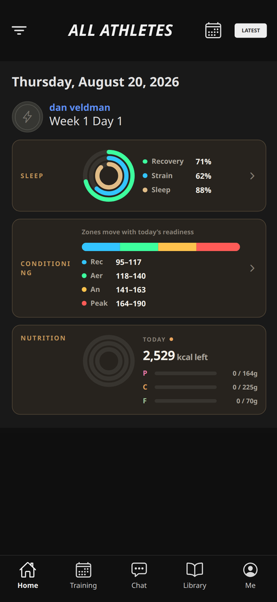
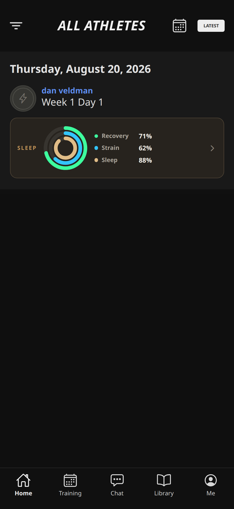
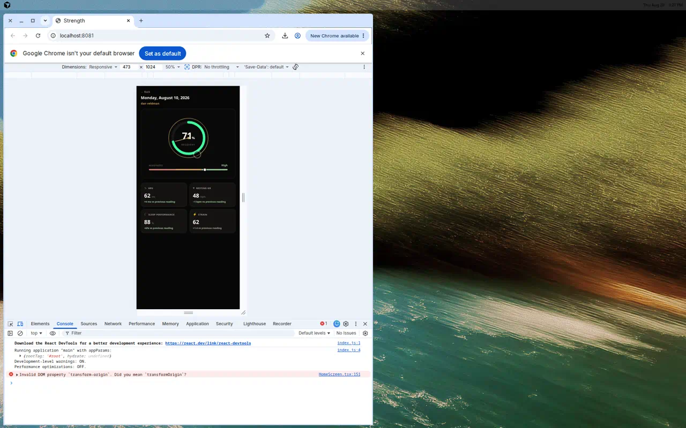
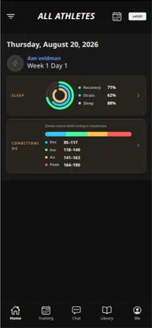

# Athlete Home — visual preview

Open this file on GitHub (or in Cursor’s Markdown preview).  
Do **not** open `home.html` expecting a rendered app — editors show it as source.

## Hybrid PWA drop-in

Installable shell (manifest + SW + Netlify): **[`pwa/`](./pwa/)**

```bash
cd apps/mobile/prototype/pwa
python3 -m http.server 4173
# http://localhost:4173
```

## Static HTML mock (desktop)

```bash
cd apps/mobile/prototype && python3 -m http.server 8765
# http://localhost:8765/home.html
```

## Home — full (Sleep + Conditioning + Nutrition)



## Home — Sleep card focus



## Readiness overview (tap Sleep)



## Conditioning capture



Source of truth for the product UI: `../src/HomeScreen.tsx`.
