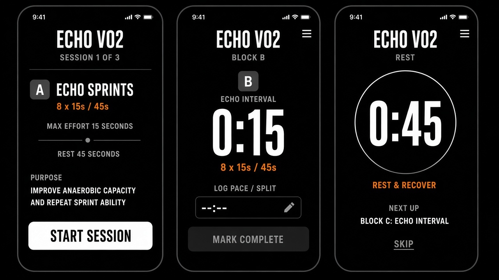
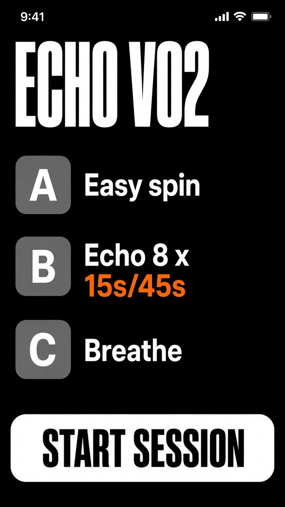
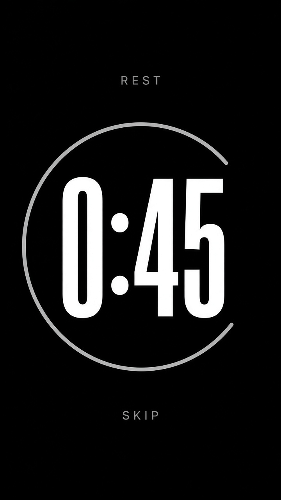
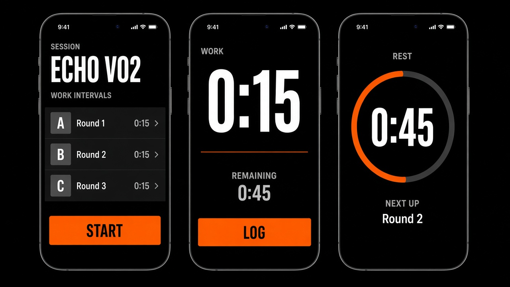
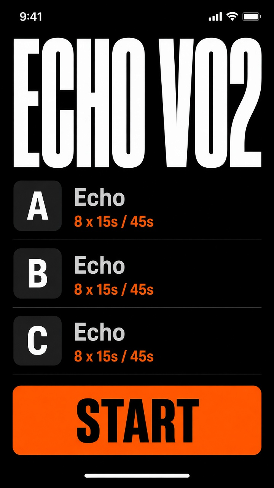
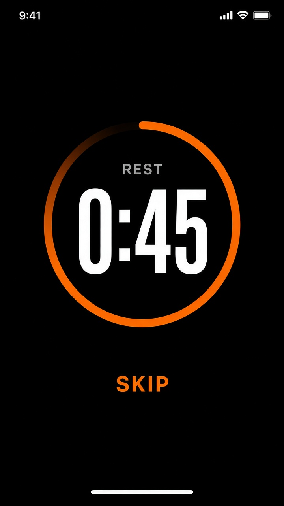

# Logger look — pick one

Status: **awaiting approval**. Live `apps/athlete/*.css` is not painted until you pick A or B.

Track Dawn is dead. Two boards, both black, both lettered, both Engine copy (Echo VO2). No Morph wordmark on the phone.

## A — TrainHeroic

True black. Gray letter tiles. Orange only on the prescription (`8 x 15s / 45s`). **White Start Session**. White rest ring.

## B — Morph-style (1:1 structure, no Morph logo)

True black. Gray letter rows. **Orange Start**. Orange **Log**. Orange rest ring. Same work/rest clock Morph uses.

Reply **A** or **B**. Then we paint the live logger.
