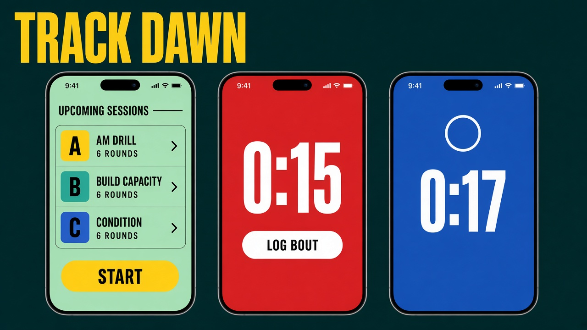
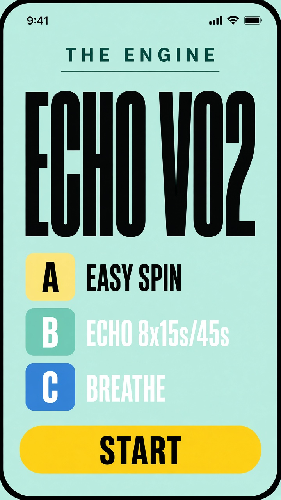
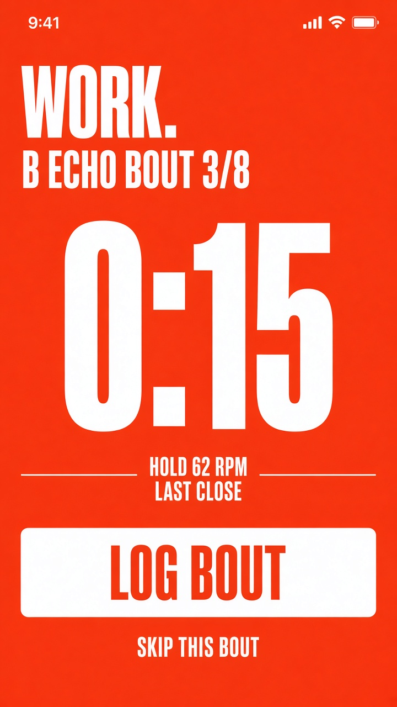
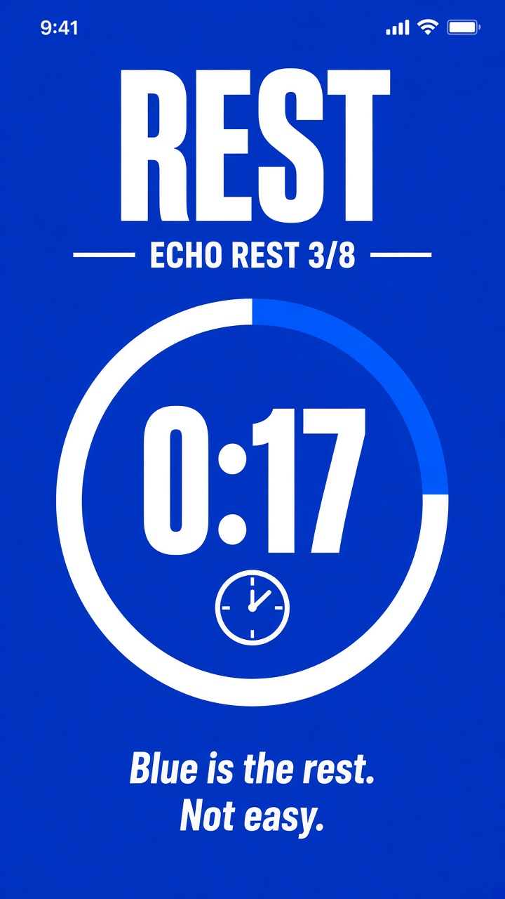

# The Engine — full-colour concept

Date: 2026-09-23  
Status: **awaiting approval**. Do not paint `apps/athlete/*.css` until you say go.

OLED true-black is rejected. This board keeps TrainHeroic structure (condensed type, letter tiles, sticky Start, rest ring) and drops the void.

## Subject

The Engine athlete logger. One indoor piece: warmup, Echo intervals, breathe. Job on each screen: know the letter, run the clock, log the bout.

## Why this palette

Not OLED. Not Morph orange. Not WHOOP lime/yellow/red as chrome (those stay on Home dials only). Blue here is **Rest**, never Easy.

| Role | Token | Hex | Where it lives |
| --- | --- | --- | --- |
| Dawn | `--canvas` | `#B6F0DC` | Training list field |
| Ink | `--ink` | `#042826` | Type on dawn |
| Paper | `--paper` | `#F4FFFB` | Nav, sheets |
| Work | `--work` | `#FF2D1A` | Whole work screen |
| Rest | `--rest` | `#2540D4` | Whole rest screen |
| Lane | `--lane` | `#FFE14A` | Start CTA, letter A |
| Engine | `--engine` | `#0B8F84` | Letter B, brand mark |

Type: **Barlow Condensed** 700 for titles, letters, clock. **Barlow** 500 for kickers.

Signature: the phone **is** the phase. Mint = list. Red = work. Blue = rest. Yellow Start is the only control that shouts on dawn.

## Screens

1. **List** — mint field, jersey letter tiles (A lane, B engine, C rest), sticky yellow **Start**.
2. **Work** — red field, white 0:15, target from last Close, white **Log bout**.
3. **Rest** — blue field, white ring + clock, skip as text. Blue means rest, not easy.

## Not in this paint (still locked)

- Live `home.css` / `logger.css` until approval
- Morph Monday minutes / auto-progress
- Lift / kg / e1rm in the athlete shell
- WHOOP colours inside the logger
