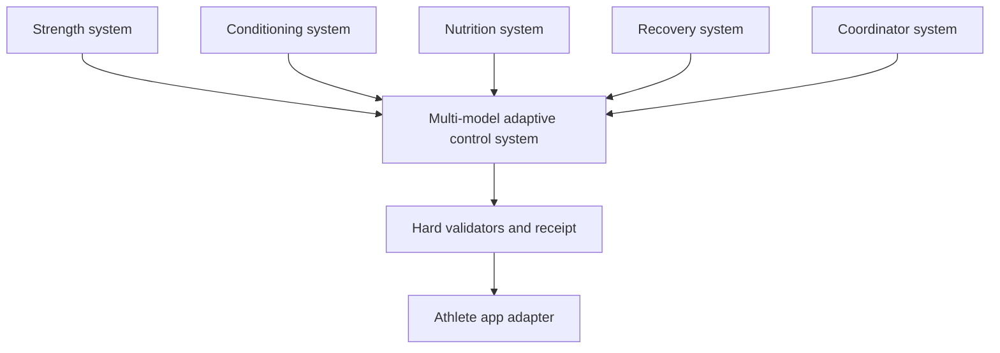
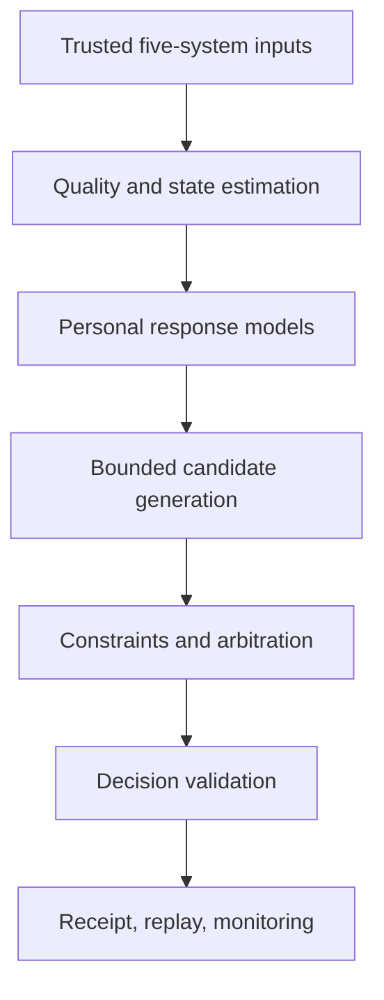

# THE Hybrid System — Non-LLM AI design scope

Status: **engineering design scope; no scientific rules, coefficients, or athlete-facing model are approved**

## 1. Executive decision

THE Hybrid System should use a deterministic, multi-model adaptive control architecture—not an LLM and not one opaque “readiness score.” Five independent systems publish structured, versioned outputs:

1. Strength
2. Conditioning
3. Nutrition
4. Recovery
5. Coordinator

All five feed the **Multi-model adaptive control system (MMACS)**. MMACS is the system brain. It estimates the athlete’s current state, learns bounded personal response models, generates feasible alternatives, resolves cross-system trade-offs, validates the result, and emits one traceable decision receipt.

The Coordinator is not the brain and does not sit above the other four systems. It is the fifth peer input. It owns schedule, goals, priorities, equipment, preferences, locks, and plan continuity. MMACS combines Coordinator context with the other four specialist outputs.

The first operational versions should be conservative and interpretable:

- deterministic rules and finite-state machines for known product policy;
- transparent statistical estimators for time-varying state;
- small, versioned personal-response models fitted offline;
- constrained selection over a finite set of bounded candidate actions;
- explicit uncertainty, abstention, shadow mode, replay, and rollback;
- no runtime network calls, LLM SDKs, raw research access, or self-modifying code.

No scientific threshold or coefficient is selected in this document. Those values enter only after the evidence platform’s promotion gates pass.

## 2. Non-negotiable boundaries

### 2.1 Product identity and system boundary

- Product name: **THE Hybrid System**.
- Runtime brain: **Multi-model adaptive control system**.
- Five peer feeds: Strength, Conditioning, Nutrition, Recovery, Coordinator.
- Runtime is local-first, deterministic for identical immutable inputs, versioned, testable, replayable, and bounded.
- Raw research cannot control the athlete app.
- An LLM may assist with offline discovery, extraction, classification, or draft synthesis only. Its output is untrusted evidence-candidate data.

### 2.2 Locked behaviour

- Training is never automatically blocked by the AI.
- Pain holds only a `strength_autopilot_load_increase` action. It does not automatically stop training or prescribe medical action.
- Illness is record-only. It may be displayed as context but cannot automatically block, reduce, or clear training.
- HRV cannot create, remove, or override pain, injury, or illness restrictions.
- Silent application is not permitted until a separate activation gate explicitly approves it.
- Strength progression and Coordinator changes must not require an accept/decline interaction when silent application is eventually approved, but every change must still produce a receipt and remain reversible.
- Pure system logic contains no persistence or external side effects. Adapters own storage, device integration, notifications, and app updates.

### 2.3 Safety interpretation

This architecture enforces product permissions and data-integrity constraints. It is not a medical diagnostic system. Clinical escalation, emergency messaging, injury classification, return-to-sport clearance, and disease-specific rules require separate expert ownership and research. Until then, the runtime records relevant user-entered events and abstains from unsupported actions.

## 3. Architecture at a glance



MMACS contains six cooperating layers:



The architecture is divided into three physically and logically separate planes.

| Plane | Purpose | Permitted contents | Prohibited contents |
|---|---|---|---|
| Evidence plane | Collect and review knowledge | Sources, observations, claims, contradictions, LLM-assisted candidate extraction | Direct athlete decisions or active runtime parameters |
| Build/learning plane | Fit and validate candidate artifacts | Frozen datasets, model training, backtests, shadow evaluation, signed promotion events | Direct app mutation or unreviewed evidence |
| Runtime plane | Produce bounded decisions | Signed runtime bundle, current athlete events, deterministic executable artifacts | Raw research, web search, LLM calls, arbitrary code, unpromoted models |

## 4. Responsibility of each system

Each specialist system owns its domain semantics. It publishes observations, derived state, candidate actions, uncertainty, and declared interactions. It does not issue the final whole-system decision.

### 4.1 Strength system

Owns:

- exercise identity, equipment and load semantics;
- performed sets, repetitions, load, RIR/RPE and technique observations;
- exercise-specific performance estimates and exposure history;
- planned strength or hypertrophy stimulus;
- candidate progressions, holds, regressions, substitutions, and volume changes;
- local fatigue/context signals and confidence;
- action-level constraints, including the locked pain policy.

Does not own:

- whole-athlete readiness;
- conditioning prescription;
- calorie or macro targets;
- clinical interpretation of pain;
- cross-system resource allocation.

### 4.2 Conditioning system

Owns:

- modality and session identity;
- duration, distance, pace, power, heart rate, work/rest structure, and device method;
- intensity-zone or session-classification outputs after research approval;
- modality-specific performance and load history;
- candidate duration, intensity, interval, density, progression, regression, or substitution actions;
- interaction descriptors such as lower-body loading, impact, and proximity to strength sessions.

Does not own:

- universal fatigue or injury scores;
- strength-load changes;
- nutrition target changes;
- a global decision to cancel training.

### 4.3 Nutrition system

Owns:

- intake records and logging completeness;
- body-mass observations and transparent trend estimates;
- energy-expenditure estimates after model validation;
- goal direction and candidate energy/macro/fuelling actions;
- uncertainty created by missing, partial, or incompatible data;
- non-diagnostic review flags.

Does not own:

- exercise progression;
- wearable calorie addition without an approved model;
- diagnosis of low energy availability or RED-S;
- automatic training restrictions.

### 4.4 Recovery system

Owns:

- sleep, resting heart rate, HRV protocol data, soreness, subjective energy/stress, heat, and life-load observations;
- data freshness, protocol compliance, missingness, and measurement quality;
- separate typed records for pain, illness, injury, and other user-entered events;
- candidate context signals with uncertainty.

Does not own:

- a universal readiness oracle;
- automatic cancellation or reduction of training;
- using HRV to create or clear pain/injury/illness restrictions;
- clinical diagnosis or return-to-sport decisions.

### 4.5 Coordinator system

Owns:

- calendar, time availability, equipment and location;
- athlete goals and their versioned priority order;
- preferences, locks, overrides, plan phase, prior decision references, and adherence context;
- schedule conflicts and plan-continuity candidates;
- explicit product-policy inputs.

Does not own:

- physiology estimation;
- independent scientific thresholds;
- final multi-system selection;
- hidden changes to another system’s proposal.

## 5. Shared interface contract

Every system output uses the common event envelope already defined by the platform. The production contract should require:

```text
event_id
athlete_id_hash
system
event_type
occurred_at
produced_at
schema_version
producer_version
payload
payload_hash
source_event_ids
quality
uncertainty
supersedes_event_id
```

Every derived feature also carries:

```text
feature_id
value
unit
denominator
time_basis
observation_status
method_id
derived_by_artifact_id
input_event_ids
valid_from
valid_until
uncertainty_representation
```

Allowed observation states are explicit: `observed`, `derived`, `estimated`, `missing`, `stale`, and `synthetic_test`. Missing is never zero. Stale is never current. Estimated is never represented as observed.

### 5.1 Domain proposal contract

Each system can publish zero or more proposals:

```json
{
  "proposal_id": "...",
  "system": "strength",
  "action_type": "...",
  "target": "...",
  "bounded_change": {},
  "expected_effects": [],
  "resource_demands": [],
  "support_tags": [],
  "interference_tags": [],
  "preconditions": [],
  "uncertainties": [],
  "rule_ids": [],
  "model_version_ids": [],
  "parameter_set_ids": [],
  "provenance_ids": [],
  "expires_at": "..."
}
```

The schema defines shape and traceability only. Scientific meanings, expected-effect models, and allowed bounds require research and validation.

## 6. Multi-model runtime design

### 6.1 Input trust gateway

The runtime first verifies, without trusting caller assertions:

- exact schema version;
- producer allow-list and producer artifact hash;
- payload hash calculated from canonical bytes;
- athlete identity scope;
- timestamps, freshness, and supersession chain;
- unit, denominator, and time-basis compatibility;
- all five required systems are present and non-empty;
- no untrusted or LLM-tainted runtime artifact is referenced.

Failed checks cannot be converted into a lower score. They create typed errors, exclude affected actions, or force abstention.

### 6.2 State estimator

The estimator produces a time-indexed state vector, not one global readiness score. Every component contains a point estimate or state label, uncertainty, data quality, and lineage.

Recommended progression of estimator families:

| Stage | Family | Role | Why it is suitable | Research dependency |
|---|---|---|---|---|
| First | Deterministic typed interpreter | Converts current and historical events into explicit states | Fully inspectable and testable | Meanings, freshness windows, valid transformations |
| Next | Robust rolling estimators | Smooth noisy measurements without hiding raw data | Simple, bounded, reproducible | Window/decay selection and measurement properties |
| Later | State-space models | Estimate latent time-varying capacity or trend | Represents process and measurement uncertainty | State definition, observation model, process noise |
| Later | Bayesian dynamic models | Maintains uncertainty and updates person-specific beliefs | Useful for sparse single-athlete history | Priors, likelihoods, calibration evidence |
| Optional | Change-point detectors | Detects regime shifts rather than assuming stable response | Useful for schedule, illness, phase, or device changes | False-alarm tolerance and event interpretation |

Candidate implementations may include linear state-space filters, robust filters, Bayesian dynamic regression, and hidden-state models. No family is activated merely because it is technically elegant. It must fit the measurement process, pass offline calibration, and remain explainable enough for replay.

The first estimator should not infer injury, illness severity, medical safety, or a universal recovery state.

### 6.3 Personal adaptation layer

Personal adaptation learns how this athlete responds to specific actions and contexts. It does not rewrite product policy or evidence claims.

Permitted initial model families:

- regularized linear or generalized linear models;
- monotonic regression where direction is evidence- and policy-constrained;
- hierarchical models that start with a reviewed population prior and update with personal data;
- Bayesian regression with explicit posterior uncertainty;
- small decision trees or generalized additive models with strict depth/shape limits;
- exercise-, modality-, and context-specific response curves;
- residual models that correct a validated population model within bounded limits.

Not recommended for initial activation:

- unconstrained reinforcement learning;
- deep neural networks trained on one athlete’s sparse data;
- black-box ensembles with no stable explanation or replay path;
- any model that learns safety policy, product permissions, or clinical restrictions;
- online parameter mutation directly inside the athlete decision transaction.

Personal models should predict narrow outcomes, not “the correct plan.” Examples of future prediction targets are measurement-level outcomes such as next comparable performance, body-mass trend, session completion, or observed response. Whether those targets are valid and actionable is a research question.

### 6.4 Candidate generation

Each domain model proposes a finite set of bounded alternatives. Candidate generation should be deterministic for a fixed state and artifact bundle.

Examples of action vocabulary, without prescribing when to use each action:

- keep;
- hold progression;
- bounded increase or decrease;
- change volume, intensity, duration, density, or timing within approved bounds;
- substitute an approved equivalent;
- reschedule;
- request data;
- record context only;
- abstain.

The candidate generator cannot produce arbitrary prose or an unbounded numeric action. Each action type has a schema, approved bounds, prerequisites, reversibility definition, and fallback.

### 6.5 Constrained decision optimisation

MMACS selects from the finite candidate set. The initial implementation should use deterministic enumeration or a transparent constraint solver rather than continuous open-ended optimization.

The abstract problem is:

\[
\text{select } a^* \in A_{feasible}
\]

where feasibility is established before scoring. Hard constraints are never penalty terms. Soft objectives may rank only feasible candidates.

Potential objective categories include goal progress, adherence feasibility, schedule fit, plan stability, uncertainty cost, and change cost. They are placeholders, not approved objectives. Their definitions and weights require research, owner decisions, and validation.

Implementation options:

- deterministic lexicographic ranking for the first release;
- constraint programming or mixed-integer optimization when scheduling interactions become complex;
- Pareto-front filtering followed by an approved deterministic tie-break policy;
- robust optimization when parameter uncertainty is explicitly represented.

The optimizer must expose why each candidate was accepted, rejected, dominated, or selected.

### 6.6 Cross-system arbitration

Arbitration resolves support, interference, timing, resource, and goal conflicts. It does not invent physiological interactions.

Required steps:

1. Normalize all proposals to approved typed effects and resource demands.
2. Reject incompatible or expired proposals.
3. Apply action-scoped product constraints.
4. Build a conflict graph from declared, evidence-backed interaction types.
5. Preserve athlete locks and Coordinator priorities according to a versioned precedence policy.
6. Enumerate feasible combinations.
7. Rank combinations using the promoted objective policy.
8. Record every rejected proposal and its reason code.

No arbitrary string such as `conflict_resolved: true` has authority. Arbitration requires an approved arbitration-policy artifact, exact version, deterministic trace, and rejected-candidate ledger.

### 6.7 Action-scoped policy constraints

The locked product behaviour is implemented as deterministic policy logic:

| Input context | Affected action | Runtime behaviour |
|---|---|---|
| Pain recorded | Strength autopilot load increase | Action is ineligible; other training actions remain available |
| Illness recorded | Any | Context is recorded only; no automatic block or reduction |
| HRV value/status | Pain, injury, illness restrictions | Cannot create, clear, or override the restriction |
| Missing approved model | All actionable recommendations | Abstain with `NO_APPROVED_MODEL` |
| Invalid artifact or provenance | Actions depending on it | Reject affected artifact/action and fail closed |

These are product locks. Wider safety or clinical behaviour is outside this scope until researched and owned.

## 7. Uncertainty and abstention

Uncertainty is carried through the entire pipeline, not added as a cosmetic confidence percentage.

### 7.1 Uncertainty types

- **Measurement uncertainty:** device error, self-report error, protocol variation.
- **Missingness uncertainty:** absent or partial observations.
- **State uncertainty:** ambiguity in the latent athlete state.
- **Parameter uncertainty:** uncertainty in learned coefficients.
- **Model uncertainty:** disagreement between eligible models or model classes.
- **Applicability uncertainty:** difference between evidence population/context and this athlete.
- **Distribution-shift uncertainty:** current inputs outside validated ranges.
- **Decision ambiguity:** near-ties between feasible candidates.

Each model defines how its uncertainty is represented and calibrated. A number cannot be labeled “confidence” without a documented interpretation and validation.

### 7.2 Mandatory abstention conditions

MMACS abstains when any of the following applies:

- no approved runtime model or rule bundle exists;
- one of the five required system outputs is missing or structurally empty;
- required data is stale, incompatible, or below the model’s validated quality contract;
- a referenced artifact is absent, unapproved, LLM-tainted, non-deterministic, or hash-mismatched;
- the athlete/context is outside the validated applicability envelope;
- no feasible candidate remains;
- unresolved contradiction affects the proposed action;
- the selected result cannot produce a complete receipt;
- replay prerequisites are unavailable;
- model disagreement exceeds an approved tolerance;
- a required owner or approval has expired or been revoked.

Abstention is a first-class output, not a crash:

```json
{
  "action": "abstain",
  "reason_codes": ["NO_APPROVED_MODEL"],
  "bounded": true,
  "silent_apply_allowed": false
}
```

## 8. Learning design

### 8.1 Offline learning

All meaningful parameter fitting initially occurs offline:

1. Freeze an input dataset and its schema.
2. Bind each row to immutable source events and transformation artifacts.
3. Define the target and evaluation protocol before fitting.
4. Train candidate models in an isolated build environment.
5. Evaluate temporal hold-outs, calibration, errors, missingness, and relevant subgroups/contexts.
6. Compare against simple baselines and the current active artifact.
7. Generate a model card, dataset manifest, parameter artifact, executable hash, and validation report.
8. Promote to shadow only through signed review gates.

### 8.2 Online observation, not immediate online control

Runtime may append new observations and outcomes to the local event ledger. It must not mutate active parameters during the same decision transaction.

Initial “online learning” is therefore delayed and controlled:

- collect outcome events;
- compute monitoring statistics deterministically;
- schedule offline refitting when data and review criteria are met;
- compare the candidate in shadow mode;
- promote a new immutable model version only after gates pass.

Later, bounded sequential Bayesian updating may be considered for selected model families. Even then, updates must be journaled, reversible, capped by approved constraints, and emitted as new parameter-set versions. Safety and product-policy artifacts remain non-learnable.

### 8.3 No autonomous reinforcement learning initially

An unrestricted agent optimizing long-term reward is inappropriate for the first system because rewards are delayed, confounded, sparse, and vulnerable to unsafe proxy optimization. If contextual bandits or reinforcement learning are ever studied, they remain offline or shadow-only until a separate research, ethics, safety, and validation programme approves them.

## 9. Cold start

Cold start must not pretend personalization exists.

### Phase 0 — no approved scientific model

- Ingest and display structured observations.
- Run data-quality and schema checks.
- Produce only abstention receipts for athlete-facing adaptive decisions.
- Permit user-authored plans and manual logging outside the AI decision path.

### Phase 1 — approved population baseline

- Use only evidence-backed, versioned baseline models within their applicability envelope.
- Mark outputs as population-based.
- Apply conservative approved bounds.
- Gather personal outcome data without claiming personal calibration.

### Phase 2 — personal calibration eligible

- Require a predeclared minimum data contract, comparable observations, and data-quality standard.
- Fit personal corrections offline.
- Compare with baseline in shadow mode.
- Activate only if the personal model improves specified metrics without violating calibration, stability, or safety tests.

No minimum sample size, period, or improvement threshold is chosen here; each is a research and validation dependency.

## 10. Drift and regime change

Drift monitoring distinguishes changes in data, athlete behaviour, devices, and model performance.

Track:

- input distribution and missingness;
- device/protocol/schema changes;
- outcome residuals and calibration;
- action frequency and magnitude;
- abstention rate and reason codes;
- model disagreement;
- plan churn and reversal frequency;
- changes in schedule, goals, phase, equipment, and reported context.

Drift responses are deterministic and staged:

1. annotate;
2. increase uncertainty or narrow eligible actions;
3. fall back to the last validated baseline;
4. abstain;
5. request offline review/refit.

Drift cannot silently relax constraints or expand an action envelope.

## 11. Shadow mode and activation

Every candidate artifact follows a non-skippable lifecycle:

```text
draft
→ validated_offline
→ shadow
→ limited_release
→ active
→ suspended/deprecated
→ retired
```

In shadow mode the model receives the same immutable input snapshot as the active path but cannot alter the athlete app. It produces a complete shadow receipt and is compared on:

- determinism and replay;
- coverage and abstention;
- disagreement with the active baseline;
- calibration and prediction error where outcomes are available;
- action magnitude and plan churn;
- product-policy violations;
- out-of-distribution behaviour;
- missing-data and extreme-input behaviour.

Promotion criteria must be defined before the shadow period begins. This scope deliberately does not choose durations, tolerances, or performance thresholds.

## 12. Rollback and revocation

Every active runtime artifact has:

- a unique ID and semantic version;
- canonical executable bytes and SHA-256 hash;
- immutable parameter-set hash;
- exact input/output schema versions;
- evidence snapshot and promotion-event IDs;
- owner and approval expiry;
- explicit rollback artifact ID;
- compatibility range;
- model card and validation report;
- monitoring and suspension conditions.

Rollback is an atomic bundle switch, not an in-place edit. The system keeps receipts created under the withdrawn version and marks later replay with the historical artifact. It never rewrites history.

A revocation cascade must suspend every dependent rule, parameter set, model, arbitration policy, and runtime bundle when a source, claim, policy, artifact hash, or approval is revoked. The safe terminal state is abstention.

## 13. Runtime bundle

Runtime reads one promoted, immutable bundle. It does not assemble authority from caller-supplied fields.

Suggested bundle contents:

```text
manifest.json
schemas/
feature-contracts/
policy-bundle/
domain-rule-bundles/
state-estimators/
personal-models/
arbitration-policy/
optimizer/
parameter-sets/
validators/
model-cards/
approval-chain/
rollback-manifest.json
```

The manifest binds every file path to its hash and declares:

- bundle ID/version;
- athlete scope;
- effective interval;
- compatible app and schema versions;
- dependency graph;
- active versus shadow artifacts;
- deterministic runtime requirements;
- approved action vocabulary and bounds;
- rollback target;
- signatures or locally trusted promotion attestations.

Runtime independently computes every hash. Fields such as `status: active` or `hash_valid: true` supplied by a request have no authority.

The runtime process should be isolated so it cannot:

- import an LLM SDK;
- access the network;
- read evidence staging or raw research directories;
- load arbitrary plugins;
- write executable files;
- change active artifacts or parameters.

## 14. Decision receipt and replay

Every attempt—action, hold, or abstention—produces a canonical receipt containing:

- receipt and decision IDs;
- normalized five-system input snapshot hash;
- each source event ID and payload hash;
- feature-transformation artifact IDs;
- state-estimator and personal-model versions;
- rule, policy, arbitration, optimizer, and parameter-set versions;
- complete candidate set;
- feasibility and rejection reason for each candidate;
- selected action or abstention;
- validator results;
- uncertainty and out-of-distribution results;
- runtime bundle hash;
- prior decision and supersession references;
- deterministic seed only if an approved algorithm requires one;
- canonical receipt hash.

Replay loads historical immutable artifacts, reconstructs normalized inputs, reruns the pipeline, and compares canonical bytes. A one-byte change in input, rule, parameter, model, or policy must fail replay.

## 15. Data prerequisites

### 15.1 Engineering prerequisites

These can be built before scientific research:

- stable IDs and append-only event ledger;
- canonical serialization and hashing;
- five domain event schemas;
- feature metadata and provenance graph;
- unit, denominator, time-basis, freshness, and supersession handling;
- runtime bundle format and artifact loader;
- deterministic execution and receipt ledger;
- review, promotion, suspension, and rollback services;
- local encryption, backup, export, and deletion controls;
- synthetic fixtures and adversarial tests;
- offline training and shadow-evaluation harnesses.

### 15.2 Scientific prerequisites

These require research before implementation values can be selected:

- valid state variables and observation relationships;
- measurement reliability, protocol requirements, and freshness windows;
- thresholds, bands, coefficients, decay rates, priors, and uncertainty models;
- valid outcome targets for each domain;
- support/interference relationships and their context dependence;
- population applicability and personal-calibration requirements;
- safe and useful action bounds;
- objective definitions and trade-off weights;
- model-evaluation metrics and acceptable error/calibration limits;
- drift, disagreement, and out-of-distribution thresholds;
- any clinical, injury, illness, pain, or return-to-training rule beyond locked product behaviour.

### 15.3 Personal-data prerequisites

Personal adaptation eventually needs comparable, timestamped history with:

- accurate action exposure;
- outcome observations;
- relevant context and missingness;
- consistent measurement semantics;
- device/protocol change markers;
- goal and plan-phase versions;
- overrides and manual corrections;
- enough variation to distinguish response from noise.

The necessary amount and duration of personal data cannot be set without defining each target model and validating its learning curve.

## 16. Staged engineering build

### Stage A — trust foundation

Build:

- canonical event and artifact hashing;
- strict five-system contracts;
- trusted runtime-bundle loader;
- fail-closed abstention executor;
- complete receipts and byte-equivalent replay;
- process isolation from LLMs, network, and research directories;
- promotion, revocation cascade, and rollback service.

Exit condition: no unapproved artifact can produce an actionable result; zero approved models always yields a valid `NO_APPROVED_MODEL` receipt.

### Stage B — synthetic control harness

Build:

- synthetic five-system data generator;
- typed state-vector assembly;
- bounded candidate generator;
- action-scoped locked policy logic;
- deterministic conflict graph and arbitration trace;
- finite candidate optimizer with placeholder synthetic objectives;
- simulation, property, fuzz, and replay tests.

Exit condition: the entire control loop runs deterministically on synthetic data without implying scientific validity.

### Stage C — research integration contracts

Build:

- evidence-to-feature dependency graph;
- parameter provenance contracts;
- model card and frozen-dataset manifests;
- offline fit/evaluation harness;
- shadow comparator and monitoring dashboard;
- activation-gate automation that still requires human approval.

Exit condition: a verified evidence package can enter the build plane without manual restructuring, but none is yet activated.

### Stage D — first narrow researched vertical slice

Research and implement one low-dimensional decision path through all layers. The path should be narrow enough that every observation, claim, transformation, parameter, action bound, and validation metric can be independently reviewed.

Exit condition: one candidate artifact passes source, claim, applicability, policy, rule/model, offline validation, and shadow gates. Research starts at the beginning of this stage.

### Stage E — personal adaptation

Build only after the baseline path is stable:

- person-specific residual or Bayesian update model;
- offline refit cadence;
- personal versus population model comparison;
- bounded update and rollback;
- drift and regime-change monitoring.

Exit condition: personal model beats the approved baseline under predeclared metrics and remains calibrated, bounded, and replayable.

### Stage F — multi-domain expansion

Add researched vertical slices one at a time, then validate pairwise and higher-order interactions. Do not activate all five domains simultaneously merely because each works independently.

Exit condition: interaction tests, conflict policies, and combined shadow evaluation pass for the specific bundle.

## 17. Test programme

### 17.1 Trust-boundary tests

1. Zero-model inputs always produce `NO_APPROVED_MODEL` abstention.
2. Caller-supplied active/hash-valid flags have no authority.
3. LLM-tainted, machine-extracted, untrusted, or unknown-origin artifacts are rejected.
4. Runtime cannot import LLM packages, access network, or read evidence directories.
5. Unknown or revoked IDs fail closed.
6. Every executable artifact is independently hashed.
7. Missing approval, owner, expiry, or rollback metadata prevents activation.

### 17.2 Five-system contract tests

8. Missing, empty, stale, superseded, or incompatible domain outputs abstain or exclude only the dependent action.
9. Missing is never converted to zero.
10. Estimated and observed values cannot be confused.
11. Unit, denominator, and time-basis incompatibilities are rejected.
12. Producer/schema incompatibility is rejected.
13. Corrected events preserve predecessor lineage.

### 17.3 Locked-policy tests

14. Pain makes only `strength_autopilot_load_increase` ineligible.
15. Pain does not automatically block all training candidates.
16. Illness is recorded but does not automatically block or reduce training.
17. HRV cannot create or clear pain, injury, or illness restrictions.
18. No hidden accept/decline state is introduced into deterministic system logic.
19. Pure engines perform no I/O or side effects.

### 17.4 Optimizer and arbitration tests

20. Hard constraints cannot be traded against scores.
21. Every conflict requires an approved arbitration-policy version.
22. Every rejected candidate has a deterministic reason.
23. Candidate order does not change the result unless order is an explicit policy input.
24. Ties use a versioned deterministic tie-break.
25. No feasible candidate yields abstention.
26. Extreme values never create an unbounded action.

### 17.5 Receipt and replay tests

27. Empty decisions, artifact lists, validators, or provenance cannot finalize.
28. Identical immutable inputs produce byte-equivalent canonical decisions.
29. Changing one input, model, parameter, rule, policy, or schema byte fails replay.
30. Historical replay uses the historical bundle, not the current bundle.
31. Failed validation makes receipt finalization technically impossible.
32. Abstention receipts are complete and replayable.

### 17.6 Learning and model-risk tests

33. Temporal leakage and target leakage checks.
34. Baseline comparison and ablation tests.
35. Calibration and uncertainty-coverage tests.
36. Missingness and protocol-change sensitivity.
37. Distribution-shift and out-of-range inputs.
38. Shadow/live feature parity.
39. Personal model cannot modify product or safety policy.
40. Parameter updates create new immutable versions.
41. Rollback restores the declared prior bundle atomically.
42. Revoked evidence suspends every dependent artifact.

### 17.7 Scale and resilience tests

43. Property and fuzz testing across malformed, duplicated, stale, sparse, and extreme events.
44. Crash recovery without partial receipt or partial bundle activation.
45. One-million-record evidence and event-store performance tests.
46. Offline operation and deterministic backup/restore.
47. Concurrent event ingestion without broken ordering or supersession.

## 18. Exact research dependencies by component

| Component | Engineering can build now | Research required before activation |
|---|---|---|
| Strength estimator | Schemas, history ledger, generic filter interface | Valid performance state, measurement error, update logic, action bounds |
| Conditioning estimator | Modality schemas, device metadata, time series interface | Intensity semantics, load/performance relationships, modality-specific progression |
| Nutrition estimator | Intake/mass schemas, missingness handling, estimator interface | Expenditure/trend model, coverage gates, coefficients, uncertainty and applicability |
| Recovery estimator | Typed observations and separate event routes | Valid use of sleep/HR/HRV/wellness data, protocol/freshness, predictive meaning |
| Coordinator | Schedule/goal/lock schemas, plan-version interface | Objective definitions, interaction priorities, conflict policy where scientific claims are involved |
| State fusion | Vector contract, lineage, uncertainty fields | Which latent states exist and how observations update them |
| Personal adaptation | Fit/version/shadow infrastructure | Target validity, priors, minimum data, update bounds, evaluation thresholds |
| Candidate generation | Bounded action schema and synthetic candidates | Allowed action set and domain-specific change limits |
| Constraints | Product-lock engine and data-integrity gates | Any physiological, clinical, or evidence-dependent constraint |
| Optimizer | Finite-set solver and deterministic tie-break framework | Objectives, weights, robust margins, acceptable trade-offs |
| Arbitration | Conflict graph and trace format | Evidence-backed support/interference edges and precedence rules |
| Drift monitor | Generic metrics and alarm pipeline | Thresholds, windows, acceptable false alarms, response policy |
| Shadow evaluation | Comparator and receipt infrastructure | Metrics, duration, pass/fail criteria, applicability checks |

## 19. The precise research stop line

Engineering can complete the trust boundary, data contracts, runtime bundle, synthetic state pipeline, optimizer shell, receipts, replay, review workflow, shadow infrastructure, rollback, and tests without making scientific choices.

Research becomes unavoidable at the first attempt to do any of the following:

- mark a scientific claim verified;
- define a physiological feature as meaningful or predictive;
- choose a threshold, coefficient, prior, decay, window, confidence band, or action bound;
- infer support or interference between systems;
- decide evidence applies to this athlete;
- define an objective or trade-off weight;
- fit or calibrate a personal-response model;
- interpret pain, illness, HRV, sleep, or another health-related observation beyond locked product behaviour;
- promote a rule/model from synthetic plumbing into athlete-facing shadow evaluation.

Therefore, the engineering handoff point is **a complete synthetic, fail-closed control loop with zero approved scientific models**. The first research task is then to select and verify one narrow vertical slice, not to research all five domains at once.

## 20. Recommended first researched vertical slice

The selection should be made using engineering and governance criteria before scientific evaluation:

- narrow output and small action vocabulary;
- high-quality data already available;
- repeated comparable observations;
- reversible and bounded actions;
- measurable outcome with short feedback delay;
- no diagnosis or clinical clearance;
- limited cross-system dependencies;
- clear manual fallback.

This document does not choose the slice because doing so requires reviewing actual data availability, evidence quality, and risk. Agent 2’s research-depth scope should define the evidence workload and selection rubric.

## 21. Delivery definition

The non-LLM AI design is ready to leave architecture and enter pre-research engineering when the following are accepted:

- five-system boundary and ownership;
- MMACS as the only final control layer;
- runtime/evidence/build-plane separation;
- strict non-LLM runtime and local-first operation;
- action-scoped locked product policies;
- finite bounded candidates and fail-closed abstention;
- immutable bundles, receipts, replay, shadow, rollback, and revocation;
- delayed offline personal adaptation;
- no scientific values or athlete-facing activation before research promotion.

The deliverable at the pre-research finish line is not an “AI that knows training.” It is a trustworthy control machine that is structurally ready to receive verified knowledge—and incapable of pretending unverified knowledge is true.
