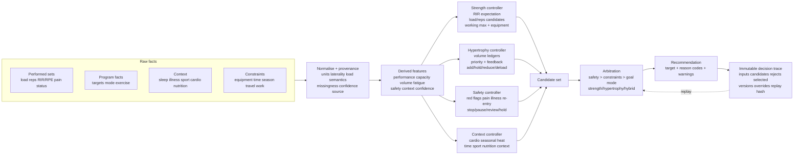

# Strength-side integrated system model

**Model:** `strength-system-model.v1`  
**Target repo:** `reflectprotect123-max/strengthside`  
**Related repo:** `reflectprotect123-max/THE-HYBRID-ENGINE1`  
**Status:** repo-ready architecture model; no vendor algorithm is claimed to be cloned.

## The model in one sentence

Strength progression, hypertrophy volume, recovery context and safety must remain separate controllers that submit candidates to one explicit arbitration layer.

```text
raw facts
  -> normalise + preserve provenance
  -> derive performance / capacity / volume / fatigue / safety / context
  -> strength controller + hypertrophy controller + safety controller + context controller
  -> arbitration by safety, goal mode and feasibility
  -> recommendation + explanation + immutable decision trace
```

MacroFactor-informed logic answers: “what load/reps are plausible for this exercise?”  
RP-informed logic answers: “how much muscle-specific work is appropriate?”  
The Hybrid layer answers: “which recommendation is allowed to win today?”

## System map



## Controller responsibilities

### Strength controller — MacroFactor-informed

The public anchor is:

```text
expected failure reps = midpoint(target rep range) + target RIR
```

It combines actual reps, reliable RIR, exercise-specific history, target ranges and feasible equipment loads. It may propose:

- add load;
- hold load and add reps;
- widen the rep range when the next equipment jump is too large;
- reduce load/reps after repeated comparable deterioration;
- hold for insufficient history or conflicting evidence;
- retest after an exercise swap, technique change or new equipment.

The exact vendor history window, coefficients, tie-breaks, fatigue model and e1RM estimator remain unknown. Those are explicit versioned Hybrid policies.

### Hypertrophy controller — RP-informed

This controller owns muscle-specific resource allocation, not the key-lift load target.

It consumes:

- direct working sets;
- indirect exposure and optional fractional projections;
- prime-mover/muscle mapping;
- Maintain/Grow/Emphasize priority;
- pump, soreness, workload and recovery timing;
- performance trend, training age, exercise fatigue cost;
- sport/cardio and time capacity.

It may propose add-set, hold-volume, reduce-set, priority change or deload-review actions. Preserve raw direct and indirect ledgers; `direct + 0.5 × indirect` is only a replaceable policy view.

RP publicly describes a 1–4 recovery/performance framework and add/hold/deload directions. That is a public training-framework anchor, not proof that every current app constant has been disclosed.

### Safety controller

Safety is a priority gate, not a readiness score:

```text
emergency_stop > training_pause > clinician_review > reentry_required
> hold_progression > caution > normal > insufficient_data
```

Missing safety information is not normal health. Pain-blocked exposures are excluded from progression evidence. This is not a diagnostic system and cannot grant medical clearance.

Current strengthside status must be preserved honestly: `pain_blocked` is classified, but the repo’s current code says nothing consumes it as a hard stop. This model defines the future seam; it does not silently restore the deleted auto-coach.

### Context controller

Context changes feasibility and confidence, not necessarily the athlete’s true strength.

Track cardio modality/duration/intensity/order/separation, sport workload, sleep/illness, nutrition context, work demands, time, travel, equipment and Australian seasonal conditions.

```text
season -> environmental/calendar constraints
       -> session feasibility + recovery context
       -> candidate bounds/confidence
       -> arbitration
```

Summer does not mean “subtract 10% strength.” Heat may alter session length, hydration/caution or scheduling; the engine must use observed performance and safety evidence before changing load.

## Arbitration contract

Controllers must never overwrite each other. Each returns a candidate:

```ts
interface ControllerCandidate {
  controller: 'strength' | 'hypertrophy' | 'safety' | 'context';
  action: string;
  allowed: boolean;
  confidence: number;
  reasonCodes: string[];
  sourceClasses: Array<
    'PRODUCT' | 'PUBLIC_BEHAVIOUR_ANCHOR' | 'SCIENCE' | 'HYBRID_POLICY' | 'UNKNOWN'
  >;
}
```

Recommended arbitration order:

1. emergency/safety prohibition;
2. clinician review or re-entry requirement;
3. pain/illness hold;
4. explicit time/equipment/program constraint;
5. goal mode — strength, hypertrophy or hybrid;
6. exercise/equipment feasibility;
7. strength candidate;
8. volume candidate;
9. user preference/presentation.

In hybrid mode, protect key-lift quality first, then spend remaining recovery budget on accessory volume. A good strength candidate and a good volume candidate can both survive when they do not compete for the same resource.

## Repo mapping

The parent repo owns conditioning, nutrition and shared ecosystem context. Strengthside owns strength tables, strength UX and the pure strength engine. They share Supabase but not migration ownership.

| Model concern | Existing strengthside home | Model role |
|---|---|---|
| target resolution | `packages/strength-engine/src/resolve.ts` | literal/range/working-max/last-load/bodyweight resolution |
| target/set shape | `prescription.ts` | prescribed targets and set metadata |
| e1RM | `e1rm.ts` | capacity analytics |
| working max | `workingMax.ts` | effective-dated capacity anchor |
| performed facts | `performed.ts`, `session.ts` | raw observations and publish-time resolution |
| exercise metadata | `exercise.ts` | identity/equipment boundary |
| exposure class | `exposure.ts` | successful/missed/pain-blocked evidence |
| current progression | `progression.ts` | existing narrow progress/hold/deload path |
| calibration | `calibration.ts` | evidence sufficiency |
| load feasibility | `rounding.ts`, `load.ts` | equipment rounding and semantics |
| future system facade | new pure module | features → candidates → arbitration → recommendation |

The existing `progression.ts` should be preserved as a named legacy policy. The integrated model should be added behind a new versioned facade, not silently replace current outputs.

## Proposed implementation slices

1. Add pure model types: `StrengthContextSnapshot`, `ControllerCandidate`, `ArbitrationDecision`, `DecisionTrace`, missingness and provenance.
2. Expand the strength controller with RIR expected-failure, exercise history, equipment-aware alternatives, cold start, swaps and retest states.
3. Add a volume controller with direct/indirect ledgers and muscle-priority policy.
4. Add read-only adapters for cardio, season, sleep, nutrition context and health events.
5. Add pure `arbitrateStrengthSystem()`; safety can veto progression, while controllers remain independently testable.
6. Expose one facade to the HTML athlete app. Screens display outputs; they do not calculate them.

## Minimum test matrix

| Scenario | Expected model result |
|---|---|
| 7–9 reps at 2 RIR, failure-equivalent performance achieved | strength progress candidate may pass |
| next machine increment is too large | hold-load/add-rep candidate |
| no comparable history | hold or athlete-selected cold start |
| exercise swap | new progression series or retest |
| direct + indirect exposure | raw ledgers retained; fractional view explicit |
| good pump/recovery/performance | volume may add under policy |
| poor recovery plus falling performance | hold/reduce/deload review |
| lower-body cardio overlap | context constraint, no blanket penalty |
| pain-blocked exposure | excluded from progression evidence |
| emergency red flag | safety candidate wins |
| missing safety check-in | insufficient-data state |
| hot-season constraint | caution/feasibility adjustment, not fixed strength penalty |
| user override | override event; original recommendation retained |

## Output contract

```ts
interface StrengthSystemRecommendation {
  athleteId: string;
  exerciseId: string | null;
  sessionId: string | null;
  mode: 'strength' | 'hypertrophy' | 'hybrid';
  action: string;
  target?: { loadKg?: number; repsLo?: number; repsHi?: number; targetRir?: number; sets?: number };
  candidates: ControllerCandidate[];
  safetyState: string;
  confidence: number;
  warnings: string[];
  reasonCodes: string[];
  formulaVersions: string[];
  policyVersions: string[];
  decisionTraceId: string;
}
```

## Non-negotiable boundaries

- This is an independent MacroFactor/RP-informed system, not a private-algorithm clone.
- Product anchors, science and Hybrid policies must be separately labelled.
- No diagnosis, medical clearance or automatic injury-risk guarantee.
- Nutrition informs context only; it does not silently rewrite training targets.
- No ACWR danger score.
- No fixed seasonal strength penalty.
- No UI-side duplicate calculations.
- No cross-repo migration ownership changes.
- Every recommendation must be replayable from its recorded inputs and versions.

