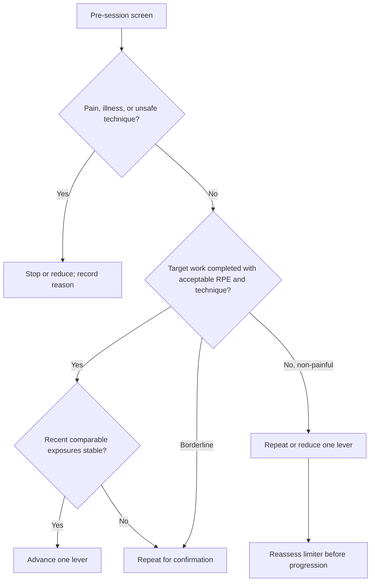

# Conditioning Evidence Handoff: Five-Modality Progression and Regression

Version: 1.0  
Date: 31 July 2026  
Population: recreational, self-directed adult athletes  
Purpose: implementation handoff for a training app and downstream review by Claude

## High-Level Overview

Air bike is a fifth modality. It must not inherit conventional cycling FTP zones, power targets, calories, distance standards, or benchmark scores by name alone.

The most defensible application architecture is:

1. Use modality-specific internal and external load signals.
2. Use RPE, technique quality, symptoms, and completed work as the main completion logic.
3. Use heart rate as a supporting signal for continuous work and a diagnostic/trend signal for short intervals, not as the sole pass/fail criterion.
4. Store the exact device, model/generation, console metric, protocol, warm-up, recovery mode, and familiarisation history with each benchmark.
5. Advance one controllable variable at a time as a product heuristic, but evaluate the total session dose and local fatigue after every change.
6. Treat failed execution, pain, illness, absence, sensor failure, and unusually high perceived effort as different states.
7. Do not use the popular 10% progression rule, HRR >12 bpm, a two-missed-session demotion, or a universal air-bike zone as if it were a validated physiological law.

The air-bike evidence is promising but narrow. Direct studies show high physiological demand, device-specific VO₂peak reliability, and positive short interventions. They do not establish long-term superiority over running, rowing, SkiErg, or conventional cycling; a universal benchmark conversion; or a separate evidence-based progression rate.

The evidence hierarchy used here is:

- **Peer-reviewed direct evidence:** the study used a combined upper-and-lower-body air-braked/fan ergometer or a clearly identified all-extremity ergometer.
- **Peer-reviewed adjacent evidence:** a lower-body air-braked cycle, arm/leg ergometry, or another modality informs a mechanism but is not transferable without qualification.
- **Official manufacturer/coaching guidance:** useful for device operation or a practical template, not proof of validity or safety.
- **Product-design recommendation:** an explicit engineering choice made because direct evidence is absent. It must be labelled in the app and tested against real user outcomes.

## Deep Dive Analysis

### 1. Device taxonomy and comparability

#### 1.1 Combined arm-and-leg fan bikes

This category includes AssaultBike/Assault AirBike, Rogue Echo Bike, Schwinn Airdyne models, Air Bike Revolution, and comparable machines on which the user drives a fan with both the pedals and reciprocating handles. The linked upper- and lower-body action makes the exercise a whole-body task, but it also means that local shoulder, arm, trunk, and leg fatigue can terminate a bout independently of the central cardiovascular response. The direct literature is small and uses different machines and protocols [S01–S09, S15].

#### 1.2 Lower-body-only air-braked cycle ergometers

This category includes research and laboratory machines such as Kingcycle and Repco air-braked cycle ergometers, plus other fan-resistance cycle ergometers that are driven only by the legs. They are not interchangeable with a combined fan bike. A lower-body Wingate or power-reliability result cannot be silently applied to an AssaultBike or Echo Bike [S13, S14, S55].

#### 1.3 Why the model must be stored

Air-braked resistance is nonlinear. In a calibrated research air-braked ergometer, power was approximately related to the cube of cadence; the exact relationship depends on the fan, gearing, flywheel inertia, calibration, environmental conditions, and measurement system [S13]. The systematic review found that fan-bike designs differ in flywheel resistance, mechanical inertia, and handle design, and that these differences can change power, RPE, and physiological responses [S01].

Therefore:

| Do not treat these as portable by default | Store these with every result |
|---|---|
| calories, watts, RPM, speed, distance, “mile time,” 2-mile time, 5-minute calories, 10-minute calories | manufacturer, model, generation, console firmware if available, display metric, test duration, warm-up, recovery mode, seat/handle setup, body mass if relevant, familiarisation count, raw output trace |

The app can compare an athlete with their own prior results on the same device and protocol. Cross-device comparisons require a validation study or a device-specific calibration layer; no such universal layer was located.

### 2. Cross-reference matrix: claim → evidence → app rule

| Implementation question | What the evidence supports | App decision | Evidence status |
|---|---|---|---|
| Is air bike a form of cycling? | It is a distinct whole-body air-braked task, not a conventional leg-cycling power task [S01–S07]. | Create `air_bike` as a fifth modality. | Direct/strong for distinction; no universal conversion |
| Can Coggan FTP zones be applied? | No direct study validates FTP-derived air-bike zones; device watts differ and combined arm/leg physiology is not conventional cycling [S01, S05–S07, S31]. | Never assign FTP zones automatically. | Evidence absent for transfer |
| What should control easy work? | Duration, conversational effort, RPE, and optional HR are practical; no universal air-bike `%HRmax` zone was validated. | Duration primary; RPE/CR10 primary internal check; HR advisory. | Mixed/direct protocol evidence, no universal boundary |
| What should control short intervals? | HR rises across repeated bouts and is delayed relative to the work; RPE and completed work are more immediate [S04, S12]. | Completed reps/work, output trend, RPE, recovery, and technique; HR secondary. | Direct/adjacent support |
| Are calories comparable? | Console calories are device-derived; cross-model calibration is absent [S01, S05, S07, S16, S17]. | Use calories only as same-device external work. | Evidence gap for portability |
| Is an air bike lower impact than running? | It is non-weight-bearing in the mechanical sense; all-extremity studies support feasibility in selected populations [S10, S11]. | Describe it as lower-impact/non-weight-bearing, not universally safer. | Adjacent/direct feasibility; injury comparison absent |
| Does large muscle mass increase stress? | Combined arm-and-leg tests can reach high VO₂, ventilation, HR, RER, and lactate, and can exceed leg-cycle responses in some studies [S01–S03, S06]. | Offer high-stress warnings and conservative onboarding. | Direct but small/device-specific |
| Does air bike need a slower progression rate? | No comparative study establishes a fixed rate versus running, rowing, SkiErg, or cycling. | Use a local-fatigue-aware progression policy, not a modality ratio. | Evidence absent; design inference |
| Should maximal testing be onboarding? | Maximal tests require familiarisation; unfamiliar Echo users showed more disagreement with treadmill VO₂max [S07]. | Use submaximal familiarisation first; make max testing optional. | Direct support |

### 3. A. Hard numbers and benchmark validity

#### A1. What can and cannot be prescribed numerically on air bike

There is no validated universal air-bike zone table. The following numbers are evidence anchors, not universal zones:

| Control signal | Sourced number or protocol | What it means | App use |
|---|---:|---|---|
| `%HRmax` | AssaultBike and Echo manuals describe a target-HR programme around `65–80%` of calculated HRmax [S16, S17]. | Manufacturer control range using age-predicted HRmax; not a validation study. | Optional continuous-work hint only; never a short-interval gate. |
| `%HRR` | In a 4-week study of `32` recreationally active adults, the continuous-training comparator used `75%` maximal HR reserve on stationary air bikes [S08]. | One study protocol, not an air-bike zone boundary. | Can inform a study-labelled moderate/vigorous comparator; do not universalise. |
| General exercise `%HRmax` | ACSM’s public infographic gives moderate `65–75%` and vigorous `76–96%` HRmax [S29]. | Broad exercise-prescription guidance, not air-bike-specific physiology. | Use only as general education if the UI says it is not a modality zone. |
| Borg RPE | Combined arm-and-leg cycling trials used RPE `9`, `13`, and `17`; perceptually regulated responses were repeatable across trials in young men [S04]. | Direct combined-arm/leg evidence for perceptual regulation, but not a modern Assault/Echo console. | Strong candidate for control; use explicit Borg 6–20 labels. |
| CR10 | ACSM materials commonly place moderate effort around CR10 `3–4` and vigorous effort around `5–7`; the direct combined-arm/leg study above used Borg 6–20, not CR10 [S29, S04]. | A useful UI scale, not a validated air-bike threshold mapping. | If the app uses CR10, label bands as app taxonomy and calibrate to personal response. |
| VT/LT | No direct study located that establishes universal VT1, VT2, LT1, or LT2 percentages for modern combined fan bikes. | Thresholds are individual and test/protocol/device dependent. | Use laboratory or device-specific threshold testing when available; do not infer from FTP. |
| RPM | Air Bike Revolution ramp: `30 RPM` starting point, then `+5 RPM/min` [S05]. Echo study ramp: `40 RPM` for men and `35 RPM` for women, with staged loading [S09]. Echo thesis ramp: `40 RPM`, then `+3 RPM every 3 min` [S15]. | Test protocols, not training zones. | Store RPM only within the same model/protocol; use personal baselines. |
| Watts | The Air Bike Revolution study reported approximately `466 W` at about ten minutes versus `250 W` on a leg cycle in most participants; the authors explicitly warn that device outputs cannot be compared directly [S05]. | Displayed watts are device-specific and can be very high on combined/fan systems. | Do not import cycling FTP percentages; retain raw watts plus device ID. |
| Calories/min | No peer-reviewed universal calorie/min boundaries or cross-model calibration were located. Moghaddam reported study-session console calories, but those are an external display metric, not a validated metabolic equivalent [S08]. | Calories are useful for same-device work tracking, not as a universal intensity scale. | Same-device baseline only; do not compare AssaultBike calories with Echo/Airdyne calories by default. |
| Distance/speed | No validated cross-model 2-mile or distance standard was located for combined fan bikes [S01, S53]. | Distance is a console-derived model metric. | Same model/protocol only. |

**Recommended intensity language for the app:**

- **Easy aerobic:** conversational or comfortable effort; duration and RPE are primary. Do not display “air-bike Zone 2” unless the athlete has a device-specific threshold anchor.
- **Threshold-oriented:** sustained controlled hard effort anchored to a personal RPE/threshold test, not a universal `%FTP`, RPM, or calorie number. Direct air-bike threshold tables are absent.
- **VO₂-oriented:** repeated hard efforts in which the athlete can preserve prescribed work and technique; use completed work, RPE, recovery, and output trend. HR is retrospective/supporting data.
- **Sprint:** near-maximal short work, with a safety screen and a familiarised athlete. Use peak/mean work or RPM only as a same-device benchmark. Do not use HR to decide whether a `10–30 s` bout was completed.

#### A2. Reliability and validity of requested benchmarks

| Benchmark | Direct combined arm-and-leg evidence? | Evidence found | Practical suitability |
|---|---|---|---|
| `30 s` sprint | **No dedicated modern Assault/Echo/Airdyne test-retest validation located.** | Lower-body Wattbike sprint reliability in trained cyclists was strong: CV approximately `4.9%` for peak power and `2.4%` for mean power, but that is a different task [S55]. | Optional trained-athlete benchmark after familiarisation; same device only. Do not call it a validated combined-air-bike Wingate. |
| `1 min` sprint / repeated sprints | **No direct reliability study located.** | `10 s:5 s` and `20 s:10 s` all-out interval formats were tested in `32` recreationally active adults for `3` sessions/week over `4` weeks [S08]. This was an adaptation study, not a reliability study. | Training format, not a benchmark validity standard. Use only after onboarding and not as the first test. |
| `5 min` max calories | **No direct validity or reliability study located.** | Popular gym/coaching benchmark; one example catalogues it alongside other tests but is not peer-reviewed [S53]. | Same-device personal benchmark only; optional. |
| `10 min` max calories | **No direct validity or reliability study located.** | Popular coaching/gym test; no evidence that it estimates VO₂max, threshold, or a transferable capacity across brands [S53]. | Useful as a same-device longitudinal performance test for trained/familiar athletes; not onboarding or a universal standard. |
| `2-mile`/distance test | **No direct combined-air-bike validation located.** | Popular programming practice, but distance output is device-derived [S01, S53]. | Same-device only; record exact console/model. |
| Wingate-style test | **No validated combined fan-bike Wingate protocol located.** | Classic Wingate is a `30 s` all-out lower-body cycle test against a prescribed braking force, commonly `7.5%` body mass on a Monark [S14]. | Do not label an air-bike sprint “Wingate” without a validated resistance and sampling protocol. |
| Ramp test | **Yes, but device-specific.** | Air Bike Revolution VO₂max test-retest `r=.96` in `18` physically active young men [S05]. Echo Bike staged test-retest in `15` recreationally active adults: relative VO₂peak ICC `=.909`, absolute ICC `=.938`, peak-power ICC `=.966`; thesis, not peer-reviewed [S15]. | Strongest air-bike benchmark family. Use device/protocol-specific ramp tests and store raw data. |
| VO₂peak test | **Yes, device-specific and protocol-dependent.** | Echo Bike versus treadmill agreement was ICC `=.89–.92` in `15` adults, but treadmill values exceeded air-bike values by about `3.31 mL·kg⁻¹·min⁻¹`; bias was larger in non-regular air-bike users (`5.09`) than regular users (`1.27`) [S07]. | Can be used with familiarisation and the same protocol; not a universal treadmill conversion. |
| Critical power / maximal aerobic power | **No modern combined-air-bike validation located.** | Air-braked ergometer calibration research shows that output accuracy must be checked when accurate power is required [S13]. | Research feature only until a device-specific protocol is validated. |
| Lower-body 10-minute cycle prediction | **Not combined.** | Older 10-minute cycle prediction work concerns lower-body cycle ergometry [S54]. | Do not use as an Assault/Echo/Airdyne standard. |

**Benchmark conclusion:** only device-specific ramp/VO₂peak testing currently has a credible direct reliability signal. The popular 5-minute, 10-minute, 2-mile, and sprint tests may be useful personal repeatability tests, but they are not validated universal air-bike standards. A benchmark record must include `device_id`, `protocol_id`, `familiarisation_sessions`, and raw output.

#### A3. Acute physiology versus long-term superiority

Combined arm-and-leg air-braked exercise can produce high cardiovascular and metabolic stress. The systematic review reports high heart rate, oxygen uptake, ventilation, respiratory exchange ratio, and lactate in air-bike stress testing [S01]. Small direct studies found higher VO₂max, HRmax, or lactate responses on a combined AssaultBike/Air Bike protocol than on a conventional leg cycle in selected active men [S05, S06]. A classic Airdyne study found combined arm-and-leg exercise changed the aerobic demand compared with leg cycling at matched external power [S03].

These findings support the statement **“air bike can be a high-stress whole-body conditioning mode.”** They do not support **“air bike is superior long-term.”** Positive intervention studies are short and population-specific:

- `10 s:5 s` and `20 s:10 s` sprint intervals improved time-to-exhaustion and VO₂max over `4` weeks in recreationally active adults, with similar adaptations to a longer moderate continuous condition [S08].
- An `8-week`, twice-weekly air-bike programme in `20` healthy active young adults improved VO₂peak by about `10.62%` and aerobic-endurance/test duration by about `18.74%`, but it was small, included a moderate-training comparator, and was not a universal beginner study [S09].
- A supervised all-extremity `4 × 4 min` protocol at `90% HRpeak`, performed `4` times/week for `8` weeks, improved VO₂peak by about `11%` in sedentary older adults; this was a non-weight-bearing all-extremity ergometer, not proof that every commercial fan bike produces the same result [S10].
- In adults with type 2 diabetes, supervised all-extremity HIIT and moderate continuous training were both feasible over `8` weeks, with no hospitalisation- or medical-treatment-level adverse events reported; the population and supervision limit transfer to self-directed users [S11].

Local muscular fatigue preceding a fully developed heart-rate response is a reasonable design hypothesis, but it is not yet well quantified on AssaultBike, Echo Bike, or Airdyne. The adjacent arm-versus-leg interval literature shows that HR and VO₂ continued to rise across repeated bouts and differed between arm and leg work, while a direct combined arm-and-leg perceptual study found RPE a reliable intensity-production frame [S04, S12]. The app should therefore record the limiter rather than claim a universal mechanism.

#### A4. Additional direct cross-checks from the benchmark and control audits

Four additional primary studies sharpen the implementation decision:

**Cross-device output comparison.** Schlegel, Křehký and Taufmann tested `10` physically active men on Assault, Echo, and Beast machines. The protocol included a `6-minute` RPE-3 block, a `10-minute` test, and a `30-second` all-out test. At 10 minutes, mean displayed values were Beast `155.0 ± 19.4` calories and `7,258.1 ± 403.7 m`; Echo `166.1 ± 24.4` calories and `6,723.8 ± 383.6 m`; Assault `163.8 ± 21.0` calories and `6,823.5 ± 401.9 m`. Thirty-second calories were Beast `17.5 ± 2.1`, Echo `20.3 ± 2.4`, and Assault `19.7 ± 2.8`. Mean/peak HR and lactate were broadly similar, while exported distance and some calorie values differed. This is direct evidence for device-specific baselines, not a universal conversion; the study did not include Airdyne and did not report test-retest reliability [S56].

**One-minute Assault test versus Wingate.** Schlegel and Křehký tested `12` competitive male CrossFit athletes with a `60-second` all-out AssaultBike test and a conventional `30-second` lower-body Wingate one week apart. Mean AssaultBike peak power was `1,268.8 ± 130.2 W`, mean Wingate power was `771.5 ± 55.9 W`, and displayed AssaultBike calories were `43.9 ± 7.2`. Ten-minute post-test lactate was `15.98 ± 0.92 mmol/L` after AssaultBike versus `13.16 ± 1.87` after Wingate; the calories/mean-Wingate-power correlation was `ρ=.894`. The study explicitly says the tests are not fully substitutable and that the AssaultBike test is not standardised [S57].

**RPE versus HR control.** In `10` physically active young men, three randomized `30-minute` Air Bike PRO sessions controlled intensity by external load anchored to ventilatory thresholds/`90%` peak VO₂, OMNI-CYCLE RPE, or HR. The study’s operating anchors were RPE `4/6/8` versus approximately `50/75/90%` HRmax. RPE-controlled VO₂ was more similar to external-load control than HR-controlled VO₂, and the authors warn that HR control can underestimate intensity in this class format. This is direct Air Bike Revolution evidence for using RPE as a practical controller, but it is not a universal CR10-to-threshold table [S58].

**Air-bike ramp performance is not pure aerobic capacity.** In `20` physically active adults, a three-minute-stage ramp-to-failure test on a combined air bike produced mean test duration around `14 minutes`, HRmax `189.7 bpm`, and RERmax `1.12`. Air-bike performance correlated more strongly with fat-free mass (`r=.86`), back squat (`r=.83`), bench press (`r=.84`), and 2-km row (`r=.85`) than with VO₂peak (`r=.68`). The test may be useful, but these relationships warn against treating a console peak score as an isolated aerobic capacity measure [S59].

Taken together, these studies strengthen the same software rule: use RPE plus completed work and same-device output, store the device/protocol, and do not use HR, calories, watts, or distance as a universal air-bike language.

### 4. B. Training load and autoregulation

#### B1. Models to preserve in the app

| Model | Formula/logic | Useful for | Do not overclaim |
|---|---|---|---|
| Session-RPE load | Session duration in minutes × post-session CR10 [S18]. | Comparing internal load across sessions and modalities when the RPE scale is explicit. | It does not prove that a session created the desired adaptation. |
| TRIMP-style HR load | Duration weighted by HR intensity [S19]. | Continuous aerobic work with reliable HR and a standard protocol. | Short intervals, local fatigue, and cardiac lag reduce validity as a completion gate. |
| External load | Duration, distance, pace, watts, calories, work, strokes, reps. | Tracking what was actually completed. | Units are not comparable across machines or modalities without calibration. |
| Readiness/context | Sleep, soreness, mood, illness, pain, recovery, stress, prior load [S21]. | Deciding whether to repeat, reduce, or stop. | No universal daily readiness cutoff is validated for this app population. |
| ACWR | Acute/chronic workload ratio. | A historical research concept. | The mathematical and causal criticisms mean it should not be an individual injury gate [S20]. |
| HR recovery | Post-exercise HR fall under a defined protocol [S22–S24]. | Personal trend under a standardised test. | `>12 bpm` at one minute is not a healthy-athlete progression cutoff. |

#### B2. Air-bike scoring hierarchy

| Session type | Primary completion signals | Secondary signals | Signals that should not be the sole gate |
|---|---|---|---|
| Steady aerobic | Duration completed; RPE appropriate; breathing/technique sustainable | HR trend, average RPM/watts/calories on the same device, post-session fatigue | Time in HR zone alone; universal calories/min |
| Threshold-oriented | Prescribed work duration completed; output reasonably stable; controlled hard RPE; no local technique failure | HR response, threshold-lab anchor, recovery between blocks | FTP percentage, HR-zone time alone |
| VO₂-oriented | Repetitions and work duration completed; output not collapsing; RPE and recovery acceptable; technique preserved | HR reaching a high value later in the set; device-specific power/RPM | HR reaching a target during every short work interval |
| Sprint/repeated sprint | Work interval completed; peak/mean output and drop-off; safe technique; recovery completed | HR and lactate if measured; repeat consistency | HR response as proof that the sprint was hard enough |

#### B3. When cardiovascular target is reached but local muscles fail

Store two independent outcomes:

- `cardiovascular_completion`: met / borderline / not met / not assessed.
- `mechanical_completion`: met / borderline / local-fatigue failure / technique failure / pain-stop.

If the athlete reaches the intended cardiovascular response but cannot complete the air-bike work because the shoulders, arms, trunk, or legs fail locally:

1. Do not advance the session.
2. If there is pain, stop and route to the safety/medical message; do not reinterpret pain as productive fatigue.
3. If there is non-painful local fatigue or technique degradation, mark the session as `cardio_pass_mechanical_fail`, repeat the same dose or reduce one lever on the next exposure.
4. Record the limiter and the point in the session at which it occurred.
5. If cardiovascular RPE is easy but local fatigue is extreme, lower the external target or shorten the work interval before changing recovery density.
6. If output collapses while HR remains high, score the work as incomplete; HR cannot rescue a failed mechanical dose.

This is a product state model informed by direct perceptual evidence and adjacent HR-response evidence, not a published air-bike algorithm [S04, S12].

#### B4. Promotion, repeat, reduction, and regression

The app should not use “one success = level up” or “two misses = demote” as scientific rules. Use the following state transitions:



“Recent comparable exposures stable” is intentionally not a hard-coded session count. Published programmes provide schedules, not a universal readiness threshold. A default of `2–3` comparable successful exposures is a product heuristic and must be labelled as such; it is not a physiological requirement [S36, S39, S42, S41].

### 5. C8. Running progression and regression

#### Evidence base

The NHS Couch to 5K plan uses `3` runs/week for `9` weeks, beginning with `1-minute` running bouts and `1:30` walking bouts and finishing with `30 minutes` continuous running [S36]. This is an official public programme, not a universal injury-prevention trial. Daniels’ E/T/I/R framework provides an established coaching structure for easy, threshold, interval, and repetition work, but paces must be individualised [S37].

The running `10%` rule is not a validated safety guarantee. In a novice-runner trial, a 10%-style programme and a standard programme produced similar injury incidence (`20.8%` vs `20.3%`, `p=.90`) [S32]. A large novice cohort did not establish a safe cutoff, and systematic-review evidence for sudden-load-change rules remains limited [S33, S34].

#### Progression tree

```text
RUNNING_START
├─ Pain, acute illness, gait change, or impact-sensitive symptoms?
│  ├─ Yes → stop/medical or recovery route; do not progress.
│  └─ No
├─ Can the athlete complete the walk/run prescription with controlled form and planned RPE?
│  ├─ No, pain-free → repeat or shorten running bouts; preserve frequency only if tolerated.
│  └─ Yes
├─ Is easy duration stable across recent comparable sessions?
│  ├─ No → repeat.
│  └─ Yes → add duration or reduce walking, one lever only (app heuristic).
├─ Continuous easy running established?
│  ├─ No → remain in walk/run or easy-duration phase.
│  └─ Yes → add relaxed strides, then threshold/cruise work.
├─ Threshold work completed without pace/RPE drift or form loss?
│  ├─ No → repeat or reduce repetitions/work duration.
│  └─ Yes → confirm before adding interval volume.
└─ VO₂-oriented interval work
   ├─ Form/pace collapses or pain appears → regress to threshold/easy.
   └─ Completed consistently → progress one of repetitions, work duration, or recovery.
```

#### Running controls

- Easy: duration and conversational/RPE response.
- Threshold: pace or time at a controlled hard effort; HR is supportive, not a short-repetition gate.
- VO₂: completed repetitions and pace; HR-zone time alone is inadequate for short intervals [S38].
- Regression triggers: pain, gait change, unusual RPE at a familiar pace, failure to complete the planned work, or a recent single-session spike. Do not encode a universal percentage safety rule.

### 6. C9. Rowing progression and regression

#### Evidence base

British Rowing’s beginner plan provides an eight-week template progressing from `1-minute` low / `1-minute` rest × `5`, to longer low/medium pieces, and later high/medium pieces and a 2k effort [S39]. British Rowing recommends approximately `18–24 strokes/minute` while learning; Concept2 describes `18–22` as technique/rhythm work, `24–28` as steady rowing, and `30–36` as short-interval or 2k-race rates [S40]. Stroke rate is not intensity on its own.

#### Progression tree

```text
ROWING_START
├─ Back, rib, shoulder, wrist, or hip pain; catch/finish unsafe?
│  ├─ Yes → stop or switch to technique-only/recovery; seek assessment if persistent.
│  └─ No
├─ Can the athlete hold sequence and posture at low rate?
│  ├─ No → shorten pieces and practise technique at approximately 18–24 spm.
│  └─ Yes
├─ Low/medium duration completed with stable stroke quality?
│  ├─ No → repeat or reduce piece length.
│  └─ Yes → add duration or one piece, not rate and duration together.
├─ Steady rowing established?
│  ├─ No → remain low/medium.
│  └─ Yes → add controlled medium/hard pieces, then higher-rate intervals.
├─ Interval pace and stroke sequence stable through all reps?
│  ├─ No → reduce rate, work duration, or number of reps.
│  └─ Yes → progress one lever.
└─ Test readiness
   ├─ Beginner/unfamiliar → submax duration or repeatable distance; no required 2k.
   └─ Trained/familiar → optional 2k/5k/30-minute test with protocol metadata.
```

#### Rowing controls

- Technique and low-rate control precede high output.
- Use completed work, pace/500 m, stroke rate, RPE, and technique together.
- Do not infer intensity from stroke rate alone.
- Regression is driven by spinal/rib/shoulder symptoms, technique breakdown, or a large pace-RPE mismatch—not by a single HR reading.

### 7. C10. SkiErg/nordic progression and regression

#### Evidence base

Concept2’s six-week beginner plan uses `2–3` SkiErg sessions/week and progresses through `1-minute` moderately hard / `1-minute` easy, `30/30`, `250 m`, `1,000 m`, `500 m`, `1,500 m`, `2,000 m`, and descending-distance work [S42]. Concept2’s technique guidance describes substantial trunk, lat, hip-hinge, and upper-body involvement [S43]. Research shows an economy difference between experienced and novice double-poling, but does not establish a beginner injury-tolerance ratio versus running or rowing [S50, S51].

#### Progression tree

```text
SKIERG_START
├─ Shoulder, elbow, rib, lumbar, or hip pain; hinge/finish unsafe?
│  ├─ Yes → stop or reduce; persistent symptoms require assessment.
│  └─ No
├─ Can the athlete repeat the hinge and finish without pulling with the arms alone?
│  ├─ No → technique-only, short easy pieces, or lower frequency.
│  └─ Yes
├─ Comfortable distance/duration completed?
│  ├─ No → repeat or reduce distance.
│  └─ Yes → add duration/distance before hard interval density.
├─ Steady technique established?
│  ├─ No → stay aerobic and technical.
│  └─ Yes → introduce short hard/easy pieces from the Concept2 template.
├─ Local upper-body fatigue causes technique loss?
│  ├─ Yes → reduce work duration or repetitions; retain recovery.
│  └─ No → progress one interval lever.
└─ Benchmark readiness
   ├─ Beginner → repeatable 1,000 m or submax duration.
   └─ Trained/familiar → optional 2,000 m or device-specific test; no universal FTP equivalent.
```

#### SkiErg controls

Duration/distance, RPE, technique, and local shoulder/trunk fatigue are primary. There is no established universal SkiErg equivalent of a cycling FTP. “Progress SkiErg slower” is a defensible conservative product policy for unfamiliar upper-body loading, not a proven cross-modality law.

### 8. C11. Conventional cycling progression and regression

#### Evidence base

Coggan’s practical cycling power levels use `<55% FTP` recovery, `56–75%` endurance, `76–90%` tempo, `91–105%` threshold, `106–120%` VO₂, `>121%` anaerobic capacity, with sprint work outside a meaningful FTP percentage [S31]. These zones are appropriate only when the athlete has a cycling power meter and a cycling-specific FTP/threshold protocol.

The common `20-minute mean power × .95` FTP estimate and approximately `75%` of highest one-minute ramp power are coaching/software conventions, not universal physiological constants [S45, S46]. In trained cyclists, FTP95 correlated with MLSS but showed individual limits of agreement; FTP95 did not necessarily track training-induced MLSS changes [S47, S48].

#### Progression tree

```text
CYCLING_START
├─ Pain, illness, unsafe bike fit, or inability to pedal smoothly?
│  ├─ Yes → stop/re-fit/recover; no progression.
│  └─ No
├─ Consistent easy riding established?
│  ├─ No → build frequency and duration at easy effort.
│  └─ Yes → add controlled tempo, one lever at a time.
├─ Cycling threshold anchor available and protocol known?
│  ├─ No → use RPE/duration and do not pretend to know FTP zones.
│  └─ Yes → use stored protocol-specific power zones.
├─ Threshold work stable without excessive RPE drift?
│  ├─ No → repeat/reduce duration or power.
│  └─ Yes → add VO₂ intervals.
├─ VO₂ intervals completed with power/technique stable?
│  ├─ No → reduce repetitions, work duration, or power.
│  └─ Yes → progress one lever.
└─ Sprint/anaerobic work
   ├─ Only when the athlete is familiar and has a reason for it.
   └─ Regress to VO₂/threshold/easy if recovery or technique is poor.
```

#### Cycling controls

Power can be primary only for conventional cycling and only when the benchmark protocol is stored. HR and RPE remain useful internal-load checks. Do not pass an air-bike watt target through this branch.

### 9. C12. Air Bike progression and regression

#### 9.1 Evidence boundary

No peer-reviewed source located here supplies a complete, validated progression from absolute beginner through steady aerobic, threshold, VO₂, and sprint work on AssaultBike, Echo Bike, and Airdyne as a single interchangeable category. The progression below is therefore a layered specification:

- **Research-supported templates:** Moghaddam’s `10/5` and `20/10` sprint intervals in recreationally active adults; Schlegel’s Echo Bike `15/45` and `40/20`/later `20/40` and `45/15` formats in active young adults; Hwang’s supervised `4 × 4 min` all-extremity protocols in older and clinical populations [S08–S11].
- **Manufacturer guidance:** AssaultBike/Echo target-HR programmes around `65–80%` calculated HRmax and preset short intervals [S16, S17].
- **Coaching practice:** 5-minute, 10-minute max-calorie, 2-mile, and similar tests [S53]. These are not validation evidence.
- **Product design:** beginner familiarisation, repeat/reduce logic, local-fatigue scoring, and device-specific baselines.

#### 9.2 Beginner familiarisation

1. Confirm seat height, handle reach, foot placement, safe mounting/dismounting, and the ability to stop without contacting the fan or handles. The manufacturer manual is the operational safety source [S16].
2. Begin below maximum effort. The app’s existing exercise-catalogue cue—start below maximum, keep rhythm repeatable, and use duration/distance/RPE—is appropriate as product copy.
3. Do not require an all-out sprint, 5-minute test, 10-minute calorie test, 2-mile test, Wingate label, or maximal ramp on onboarding.
4. Use a short, easy, repeatable exposure until the user can coordinate both handles and pedals without shoulder shrugging, trunk collapse, uncontrolled cadence, or pain. A precise universal starting duration/frequency was not located; any default such as `5–10 minutes` or `1–2 sessions/week` must be labelled a conservative product recommendation, not a sourced physiological rule.
5. Repeat the same familiarisation dose until the user’s execution is stable. The default `2–3` comparable exposures before promotion is a product heuristic; published air-bike studies do not validate that exact count.

#### 9.3 Steady aerobic work

Progress in this order unless the athlete’s data justify another choice:

1. Repeatable technique and easy RPE.
2. Session duration.
3. Frequency, if recovery and schedule support it.
4. Same-device average RPM, watts, or calories as a descriptive trend—not a universal target.

Use conversational effort/RPE as the control. HR can help identify an unexpectedly high internal response during continuous work, but no universal air-bike `%HRmax` or `%HRR` zone is established. Manufacturer `65–80%` HRmax programmes and the study `75% HRR` condition are protocol examples, not universal boundaries [S08, S16, S17].

#### 9.4 Threshold-oriented work

Direct air-bike evidence for a universal threshold prescription is absent. The app should only expose a “threshold-oriented” label when one of these anchors exists:

- a device- and protocol-specific threshold test;
- a laboratory VT/LT result recorded for the same task;
- a personal RPE/work prescription that has been repeatedly tolerated and produces stable output.

For self-directed recreational users without those anchors, use controlled hard intervals with duration and RPE rather than a false RPM, watt, calorie, or FTP number. Increase only one of work duration, number of blocks, output, or reduce recovery after repeated stable execution.

#### 9.5 Repeated intervals and VO₂-oriented work

The strongest direct recreational-adult intervention is Moghaddam et al.: three air-bike sessions/week for four weeks, comparing `3 sets of 8` all-out `10 s work:5 s rest` intervals, or `3 sets of 8` all-out `20 s:10 s`, with set recoveries of `2.5` and `5` minutes respectively [S08]. This population was recreationally active, not absolute beginners.

The Echo Bike study used `20` sets of `15 s:45 s` and `25` sets of `40 s:20 s`, then changed the later four-week work/recovery ratios to `20 s:40 s` and `45 s:15 s`, twice weekly for eight weeks [S09]. The exact protocol is study-specific and should not be presented as the universal air-bike ladder.

Hwang’s `4 × 4 min` at `90% HRpeak` was performed under supervision four times weekly in sedentary older adults and in a separate older type-2-diabetes sample; this supports feasibility of longer all-extremity intervals in selected supervised populations, not unsupervised beginner programming [S10, S11].

There is no direct modern combined-air-bike evidence establishing `30/30` or `60/60` as superior, or showing which is best for beginners. If the app offers these formats, label them as product programming derived from general interval practice, not as validated air-bike standards.

#### 9.6 Sprint work

Sprint work should be reserved for a familiar athlete with no active pain and stable handle/pedal technique. Use peak/mean watts, RPM, calories, or work only as same-device observations. Do not use HR completion because the interval may end before HR reflects the effort. The standard Wingate is not an air-bike validation shortcut [S14].

#### 9.7 Air-bike progression tree

```text
AIR_BIKE_START
├─ Safety/fit screen fails, pain, acute illness, or unsafe mounting/dismounting?
│  ├─ Yes → stop, correct/refer, and do not advance.
│  └─ No
├─ Can the athlete coordinate linked handles and pedals at easy effort?
│  ├─ No → familiarisation dose; lower duration/output; no maximal test.
│  └─ Yes
├─ Can the athlete complete easy duration with repeatable rhythm and acceptable local fatigue?
│  ├─ No, pain-free → repeat or shorten duration; log limiter.
│  └─ Yes → advance duration or frequency, one lever at a time.
├─ Is steady aerobic work stable across comparable exposures?
│  ├─ No → repeat.
│  └─ Yes → introduce controlled hard/threshold-oriented blocks using RPE/work.
├─ Does local fatigue or technique fail before planned work is complete?
│  ├─ Yes, no pain → cardio_pass_mechanical_fail; repeat/reduce, do not advance.
│  ├─ Yes, pain → stop and safety route.
│  └─ No → continue.
├─ Are interval reps completed with stable output and recovery?
│  ├─ No → reduce one lever: reps, work duration, output, or density.
│  └─ Yes → confirm over comparable sessions, then progress one lever.
├─ Is the athlete familiar and specifically ready for maximal work?
│  ├─ No → stay submaximal/repeatable; no sprint/ramp benchmark.
│  └─ Yes → optional device-specific sprint, ramp, or distance/calorie test.
└─ Any cross-device comparison requested?
   ├─ No → compare personal same-device trend.
   └─ Yes → display “not directly comparable” unless a validated mapping exists.
```

#### 9.8 Air-bike regression tree

```text
AIR_BIKE_REGRESSION
├─ Pain in shoulder, elbow, rib, lumbar spine, hip, or other tissue?
│  ├─ Acute/severe/worsening → stop and seek appropriate assessment.
│  └─ Mild/persistent → stop the provoking dose; do not progress through pain.
├─ Technique breakdown without pain?
│  ├─ Yes → reduce output, work duration, or repetitions; preserve recovery.
│  └─ No
├─ Local muscular failure while HR/RPE is high?
│  ├─ Yes → mechanical failure; repeat or reduce; HR does not count as completion.
│  └─ No
├─ Output falls markedly across reps while recovery worsens?
│  ├─ Yes → reduce density or total repetitions; do not add watts/RPM.
│  └─ No
├─ RPE is unexpectedly high for a familiar dose?
│  ├─ Yes → repeat or reduce after checking sleep, illness, heat, device, and setup.
│  └─ No → maintain or progress one lever after confirmation.
└─ Missed session without failure?
   ├─ No automatic demotion.
   └─ Resume last successful dose; distinguish absence from failed execution.
```

#### 9.9 Air-bike controls by phase

| Phase | Primary | Secondary | Avoid |
|---|---|---|---|
| Familiarisation | safe coordination, duration, technique | easy RPE, local fatigue | max test, HR gate, calorie comparison |
| Steady aerobic | duration, RPE, sustainable rhythm | HR, same-device output | universal “Zone 2,” FTP, calorie/min standard |
| Threshold-oriented | completed blocks, controlled hard RPE, stable technique | personal VT/LT/HR, same-device output | arbitrary RPM/watt/FTP target |
| Repeated intervals | completed reps/work, output drop-off, recovery | HR trend, RPE, local fatigue | HR target during short work |
| VO₂-oriented | work duration/reps, output consistency, high but controlled RPE | late-bout HR, lab VO₂ | requiring HR to rise inside every short interval |
| Sprint | safe peak/mean work, technique, recovery | peak HR, lactate if measured | calling it Wingate without validated protocol |

### 10. Cross-modality load comparison

Do not compare `30 calories` on an Echo Bike with `30 calories` on an AssaultBike, `30 calories` on a rower, or a run distance as if they were equal external loads. The number may be an instrument-specific estimate and does not include the same mechanical work, muscle distribution, or metabolic cost.

The app should compare modalities at the level of intended training stress, not raw console units:

- **Easy/steady:** time at an individually tolerable RPE and stable technique.
- **Threshold:** completed controlled work at a repeatable hard effort.
- **VO₂:** completed high-intensity work and recovery quality.
- **Sprint:** short maximal work and repeatability, with local tissue tolerance.

Cross-modality session-RPE can describe internal load, but it should not be interpreted as proof that one minute of air bike equals one minute of running, rowing, SkiErg, or conventional cycling [S18–S21].

### 11. Injury and impact claims

No direct epidemiologic or comparative injury-incidence study for modern AssaultBike, Echo Bike, or Airdyne training was located for shoulder, elbow, rib, lumbar, hip, or overuse injury outcomes. The report therefore cannot supply a prevalence percentage, relative risk, or universal safety claim.

Reasonable but unproven product-design concerns include:

- repeated shoulder/elbow handle motion;
- high-force trunk stabilisation and rib/lumbar loading;
- hip and knee loading from high cadence or poor seat setup;
- local fatigue causing compensatory technique;
- acute entanglement or contact hazards around moving handles, pedals, and fan [S16].

The language should be: **“Air bike is non-weight-bearing and may be a lower-impact option than running for some users, but its injury risk is not universally lower and the evidence does not establish a safer modality for everyone.”**

### 12. Evidence gaps that must remain visible in the app

The following are unresolved rather than missing because of a search oversight:

1. Universal air-bike intensity zones by `%HRmax`, `%HRR`, CR10, VT/LT, RPM, watts, calories/min, or distance.
2. A validated conversion between AssaultBike, Echo Bike, Airdyne, Air Bike Revolution, and other models.
3. Test-retest reliability and construct validity for modern combined-air-bike `30 s`, `1 min`, repeated-sprint, `5 min`, `10 min`, `2-mile`, and Wingate-style tests.
4. A modern combined-air-bike critical-power or maximal-aerobic-power model.
5. Direct injury incidence for shoulders, elbows, ribs, lumbar spine, hips, and overuse patterns.
6. A validated beginner progression rate relative to running, rowing, SkiErg, or conventional cycling.
7. Direct beginner evidence for `10/5`, `20/10`, `30/30`, `60/60`, and longer air-bike intervals.
8. Evidence that a given air-bike test predicts long-term performance or training response.
9. Evidence that HRR measurement from consumer sensors is stable enough to gate progression in a self-directed app.
10. A validated universal rule for how many comparable sessions must precede phase advancement.

## Counterpoints/Challenges

### “Air bike uses more muscle, so it must be better.”

More recruited muscle can increase total physiological demand, but the best exercise depends on the goal, tolerance, technique, adherence, and injury history. Acute VO₂/HR/lactate differences do not establish long-term superiority [S01, S05, S06, S08, S09].

### “The fan makes watts and calories objective.”

The display is objective only within its own measurement system. Air resistance and display algorithms vary, and environmental/device calibration matters [S01, S05, S13].

### “A high heart rate proves the interval was completed.”

Not for short work. HR continues to rise across repeated bouts and may remain high after the mechanical output has fallen; the direct combined arm-and-leg study supports RPE as a reliable intensity-production frame [S04, S12].

### “Non-weight-bearing means safer.”

It means lower ground-impact demand than running, not zero injury risk. Direct injury comparisons were not located [S10, S11].

### “CrossFit protocols are validated standards.”

They are often useful coaching templates. Unless a peer-reviewed study names the device, population, protocol, and outcome, they must be labelled coaching practice or product design. The popular 5-minute, 10-minute, and 2-mile tests fall into this category [S53].

### “The same progression algorithm can cover every modality.”

The state machine can be shared, but the signals cannot. Running needs impact/gait and pain logic; rowing and SkiErg need technique/local upper-body logic; cycling can use FTP only when justified; air bike needs device metadata and local-fatigue scoring.

## Actionable Next Steps

### 1. App data schema

Add these fields to every session and benchmark:

```json
{
  "modality": "air_bike",
  "submodality": "combined_arm_leg_fan",
  "device": {
    "manufacturer": "Rogue",
    "model": "Echo Bike",
    "generation": "V3.0",
    "firmware": null,
    "console_metric": "watts"
  },
  "protocol": {
    "id": "echo_ramp_40rpm_plus3rpm_3min",
    "warmup": null,
    "work_recovery": null,
    "recovery_mode": null,
    "familiarisation_sessions": 1
  },
  "internal_load": {
    "rpe_scale": "CR10",
    "session_rpe": null,
    "hr_avg": null,
    "hr_peak": null,
    "hrr_protocol": null
  },
  "external_load": {
    "duration_s": null,
    "avg_rpm": null,
    "peak_rpm": null,
    "avg_watts": null,
    "peak_watts": null,
    "console_calories": null,
    "distance": null,
    "completed_reps": null
  },
  "quality": {
    "cardiovascular_completion": "met",
    "mechanical_completion": "local_fatigue_failure",
    "technique_quality": "degraded",
    "limiter": "shoulder_local_fatigue",
    "pain": false
  }
}
```

### 2. Completion algorithm

```text
if pain or unsafe technique:
    STOP_OR_SAFETY_ROUTE
elif session_absent:
    HOLD_LAST_SUCCESSFUL_DOSE
elif steady_work:
    pass = duration_complete and rpe_acceptable and technique_stable
    hr = advisory_only
elif interval_work:
    pass = reps_complete and work_complete and technique_stable
           and recovery_acceptable and output_not_collapsing
    hr = secondary/diagnostic
if cardiovascular_target_met and mechanical_target_failed:
    outcome = CARDIO_PASS_MECHANICAL_FAIL
    next_action = REPEAT_OR_REDUCE
elif pass and comparable_recent_exposures_stable:
    next_action = ADVANCE_ONE_LEVER
elif pass:
    next_action = REPEAT_FOR_CONFIRMATION
else:
    next_action = REPEAT_OR_REDUCE
```

### 3. Source/model backup for Claude

Use the accompanying files:

- `conditioning_source_model_manifest.json`: source IDs, direct URLs/DOIs, populations, modality scope, evidence tier, exact numbers, limitations, research models, and tree rules.
- `modality_progression_regression_trees.json`: machine-readable trees for running, rowing, SkiErg, conventional cycling, and air bike.
- `modality_progression_regression_trees.mmd`: compact visual Mermaid diagrams for review.

The source backup preserves citation metadata, direct article URLs/DOIs, extracted evidence notes, and limitations. It does not redistribute full copyrighted article PDFs. Open-access links are provided where available.

### 4. QA checklist before shipping

- Verify the UI names the RPE scale as Borg 6–20 or CR10; do not mix them.
- Add `air_bike` to every modality selector, benchmark table, progression rule, regression rule, analytics view, and export schema.
- Block automatic FTP-zone assignment for air bike.
- Require device-specific benchmark metadata.
- Do not compare raw calories, watts, RPM, speed, or distance across fan-bike brands.
- Remove short-interval HR-zone time as a hard pass/fail condition.
- Keep HRR as a trend only; do not use a one-minute `12 bpm` threshold as an athlete gate [S22–S24].
- Record local fatigue and technique failure separately from cardiovascular completion.
- Label all `2–3 exposure` confirmation logic, one-variable progression, and beginner duration defaults as product heuristics.
- Make maximal testing optional and post-familiarisation.
- Keep the evidence gaps visible in engineering documentation and user-facing copy where a false universal number would be misleading.

## Source Registry

The full registry, source tiers, exact population notes, and model mappings are in `conditioning_source_model_manifest.json`. The key direct sources are listed below.

### Air-bike and combined arm/leg evidence

- **S01** — Schlegel, “Health benefits of using air biking: a systematic review” (2022), DOI [10.58727/jshr.88637](https://doi.org/10.58727/jshr.88637). Full-text PDF: [UHK repository](https://digilib.uhk.cz/bitstream/handle/20.500.12603/1598/88637-Texto_del_articulo-342830-1-10-20220829_%281%29.pdf?isAllowed=y&sequence=1).
- **S02** — Nagle, Richie & Giese, “VO₂max responses in separate and combined arm and leg air-braked ergometer exercise” (1984), DOI [10.1249/00005768-198412000-00007](https://doi.org/10.1249/00005768-198412000-00007); [PubMed](https://pubmed.ncbi.nlm.nih.gov/6513773/).
- **S03** — Hoffman et al., “Does the amount of exercising muscle alter the aerobic demand of dynamic exercise?” (1996), DOI [10.1007/BF02376770](https://doi.org/10.1007/BF02376770).
- **S04** — Hill et al., “The validity and reproducibility of perceptually regulated exercise responses during combined arm + leg cycling” (2020), DOI [10.1007/s00421-020-04444-z](https://doi.org/10.1007/s00421-020-04444-z); [PubMed](https://pubmed.ncbi.nlm.nih.gov/32710290/).
- **S05** — Canário-Lemos et al., “Validity and reliability of maximum oxygen uptake on an Air Bike arm- and leg-ergometer” (2022), DOI [10.6063/motricidade.26611](https://doi.org/10.6063/motricidade.26611); [article](https://revistas.rcaap.pt/motricidade/article/view/26611), [PDF](https://revistas.rcaap.pt/motricidade/article/download/26611/20757/131542).
- **S06** — Pearson, Garcia & Jenkins, “Comparison of a ramp cycle ergometer and a staged Assault Fitness AssaultBike protocol for the assessment of VO₂max” (2023), DOI [10.70252/RDUK7353](https://doi.org/10.70252/RDUK7353); [article](https://digitalcommons.wku.edu/ijes/vol16/iss4/12).
- **S07** — Lipscomb et al., “Agreement of Air Bike and Treadmill Protocols To Assess Maximal Oxygen Uptake” (2024), DOI [10.70252/STRQ5031](https://doi.org/10.70252/STRQ5031); [full text](https://pmc.ncbi.nlm.nih.gov/articles/PMC11166135/).
- **S08** — Moghaddam et al., “Sprint Interval Training on Stationary Air Bike Elicits Cardiorespiratory Adaptations While Being Time-Efficient” (2023), DOI [10.1519/JSC.0000000000004483](https://doi.org/10.1519/JSC.0000000000004483); [PubMed](https://pubmed.ncbi.nlm.nih.gov/37616537/).
- **S09** — Schlegel, Křehký & Hiblbauer, “Physical fitness improvement after 8 weeks of high-intensity interval training with air bike” (2022), DOI [10.26773/smj.221012](https://doi.org/10.26773/smj.221012); [article PDF](https://sportmont.ucg.ac.me/clanci/SM_October_2022_Schlegel.pdf), [repository PDF copy](https://blog.performancelab16.com/optothoa/2022/07/Physicalfitnessimprovementafter8weeksofhigh-intensityintervaltrainingwithairbike-1.pdf).
- **S10** — Hwang et al., “Novel all-extremity high-intensity interval training improves aerobic fitness, cardiac function and insulin resistance in healthy older adults” (2016), DOI [10.1016/j.exger.2016.06.009](https://doi.org/10.1016/j.exger.2016.06.009); [PubMed](https://pubmed.ncbi.nlm.nih.gov/27346646/).
- **S11** — Hwang et al., “Effect of all-extremity high-intensity interval training vs. moderate-intensity continuous training on aerobic fitness in middle-aged and older adults with type 2 diabetes” (2019), DOI [10.1016/j.exger.2018.12.013](https://doi.org/10.1016/j.exger.2018.12.013); [PubMed](https://pubmed.ncbi.nlm.nih.gov/30576716/), [full text](https://pmc.ncbi.nlm.nih.gov/articles/PMC6404965/).
- **S12** — Astorino & Emma, “Differences in Physiological and Perceptual Responses to High Intensity Interval Exercise Between Arm and Leg Cycling” (2021), DOI [10.3389/fphys.2021.700294](https://doi.org/10.3389/fphys.2021.700294); [full text](https://www.frontiersin.org/journals/physiology/articles/10.3389/fphys.2021.700294/full).
- **S13** — Maxwell et al., “Dynamic calibration of mechanically, air- and electromagnetically braked cycle ergometers” (1998), DOI [10.1007/s004210050430](https://doi.org/10.1007/s004210050430); [PubMed](https://pubmed.ncbi.nlm.nih.gov/9754975/), [PDF copy](https://www.usada.org/wp-content/uploads/R062.pdf).
- **S14** — Driss, “The Measurement of Maximal (Anaerobic) Power Output on a Cycle Ergometer: The Wingate Test” (2013), [open review](https://pmc.ncbi.nlm.nih.gov/articles/PMC3773392/).
- **S15** — Livingston, “Reliability Of Staged Maximal Aerobic Capacity Protocol Using A Combined Upper- And Lower-Body Air-Braked Ergometer” (2026), UCF master’s thesis; [record and abstract](https://stars.library.ucf.edu/gradstudies_etd_2026/108/). This is not peer-reviewed journal evidence.
- **S16** — AssaultBike Classic owner’s manual, [manual copy](https://resources.sport-tiedje.com/pdf/assault/Assualt%20Bike%20Classic%202023%20Manual.pdf). Manufacturer guidance, not validation.
- **S17** — Rogue Echo Bike user guide, [manual copy](https://fitatmidlife.com/wp-content/uploads/Echo-Bike-User-Guide-FINAL-v2-3-7-19.pdf). Manufacturer guidance, not validation.
- **S53** — Example coaching catalogue of 5-minute, 10-minute, 2-mile, and other AssaultBike tests, [Fit at Midlife](https://fitatmidlife.com/28-awesome-assault-bike-workouts/). Coaching practice, not peer-reviewed validation.
- **S54** — Vanderburgh, “The 10-min Cycle Ergometer Test: A Body Mass Adjusted Test of VO₂ peak Prediction” (1998), [record](https://www.ovid.com/jnls/nsca-jscr/abstract/00124278-199802000-00003~the-10-min-cycle-ergometer-test-a-body-mass-adjusted-test-of). Lower-body cycle context, not combined fan-bike validation.
- **S55** — Driller, Argus & Shing, “The Reliability of a 30 Second Sprint Test on the Wattbike Cycle Ergometer” (2012), [PDF](https://www.woodway.com/wp-content/uploads/2024/01/reliability_of_30_sec_sprinttest.pdf). Lower-body cycle context, not combined fan-bike validation.
- **S56** — Schlegel, Křehký & Taufmann, “Comparison of air bikes and their effect on selected physiological parameters” (2021), DOI [10.32725/sk.2021.005](https://doi.org/10.32725/sk.2021.005); [journal record](https://sk.pf.jcu.cz/artkey/stk-202101-0005_komparace-air-biku-a-jejich-efektu-na-vybrane-fyziologicke-parametry.php), [full PDF](https://digilib.uhk.cz/bitstream/handle/20.500.12603/1282/StudiaKin_stk-202101-0005_%281%29.pdf?sequence=1). Direct comparison of Assault, Echo, and Beast in 10 active men; no test-retest reliability.
- **S57** — Schlegel & Křehký, “Anaerobic fitness testing in CrossFit” (2020), DOI [10.2478/afepuc-2020-0018](https://doi.org/10.2478/afepuc-2020-0018); [repository record](https://digilib.uhk.cz/handle/20.500.12603/1139?locale-attribute=en), [full PDF](https://digilib.uhk.cz/bitstream/handle/20.500.12603/1139/Anaerobic_Fitness_Testing_in_Crossfit.pdf?isAllowed=y&sequence=1). Direct 60-second AssaultBike versus 30-second Wingate comparison in 12 competitive male CrossFit athletes; not reliability validation.
- **S58** — Canário-Lemos et al., “Control of the intensity of effort: heart rate or rate of perceived effort” (2023), DOI [10.47197/retos.v49.97762](https://doi.org/10.47197/retos.v49.97762); [article](https://revistaretos.org/index.php/retos/article/view/97762), [PDF](https://revistaretos.org/index.php/retos/article/download/97762/72478/367849). Direct Air Bike Revolution class study comparing external-load, RPE, and HR control in 10 active young men.
- **S59** — Schlegel, Křehký, Hiblbauer & Faltys, “Air biking as a new way for stress testing” (2022), DOI [10.1051/sm/2022001](https://doi.org/10.1051/sm/2022001); [journal record](https://www.mov-sport-sciences.org/articles/sm/ref/2022/02/sm210052/sm210052.html), [repository/abstract](https://www.sciengine.com/MSS/doi/10.1051/sm/2022001). Direct ramp-to-failure stress-testing study in 20 active young adults; performance related more to fat-free mass and strength than to VO₂peak.
- **S60** — Ponce-García et al., “The Anaerobic Power Assessment in CrossFit® Athletes” (2021), DOI [10.3390/ijerph18168878](https://doi.org/10.3390/ijerph18168878); [MDPI article](https://www.mdpi.com/1660-4601/18/16/8878), [PubMed](https://pubmed.ncbi.nlm.nih.gov/34444626/). Direct AssaultBike/30-second anaerobic-power comparison context; not a universal air-bike Wingate validation.

### Intensity, load, and autoregulation

- **S18** — Foster et al., session-RPE method (2001), DOI [10.1519/00124278-200102000-00019](https://doi.org/10.1519/00124278-200102000-00019).
- **S19** — Foster, Rodríguez-Marroyo & de Koning, internal/external load methods (2017), DOI [10.1123/IJSPP.2016-0388](https://doi.org/10.1123/IJSPP.2016-0388).
- **S20** — Impellizzeri et al., ACWR critique (2020), DOI [10.1123/ijspp.2019-0864](https://doi.org/10.1123/ijspp.2019-0864).
- **S21** — Saw et al., monitoring training response and subjective wellness (2015), [full text](https://pmc.ncbi.nlm.nih.gov/articles/PMC4789708/).
- **S22** — Cole et al., HR recovery and mortality (1999), DOI [10.1056/NEJM199910283411804](https://doi.org/10.1056/NEJM199910283411804). Clinical prognostic protocol, not an athletic progression gate.
- **S23** — Costa et al., HRR test-retest reliability (2020), [PDF](https://archivosdemedicinadeldeporte.com/articulos/upload/or01_Costa_ingles.pdf).
- **S24** — Daanen et al., HRR in athletes and trained populations (2012), DOI [10.1123/ijspp.7.3.251](https://doi.org/10.1123/ijspp.7.3.251).
- **S25** — Chen, Fan & Moe, Borg RPE meta-analysis (2002), DOI [10.1080/026404102320761787](https://doi.org/10.1080/026404102320761787).
- **S26** — Scherr et al., RPE and physiological intensity in `2,560` adults (2013), [PubMed](https://pubmed.ncbi.nlm.nih.gov/22615009/).
- **S27** — Grummt et al., RPE anchors in cardiopulmonary exercise testing (2024), DOI [10.1186/s40798-024-00729-1](https://doi.org/10.1186/s40798-024-00729-1).
- **S28** — Arney et al., RPE/CR10 and HRR during interval exercise (2019), DOI [10.26582/k.51.2.1](https://doi.org/10.26582/k.51.2.1).
- **S29** — ACSM aerobic exercise intensity infographic (2025), [PDF](https://acsm.org/wp-content/uploads/2025/02/Exercise-intensity-infographic-PDF.pdf).
- **S30** — Concept2 heart-rate training guidance, [official guide](https://www.concept2.com/blog/heart-rate-training-with-your-concept2-erg).
- **S31** — Coggan cycling power levels, [TrainingPeaks](https://www.trainingpeaks.com/blog/power-training-levels/). Established coaching model, not a universal physiological law.

### Progression and modality sources

- **S32** — Buist et al., novice running progression trial (2008), DOI [10.1177/0363546507307505](https://doi.org/10.1177/0363546507307505).
- **S33** — Nielsen et al., novice-running progression and injury cohort (2014), DOI [10.2519/jospt.2014.5164](https://doi.org/10.2519/jospt.2014.5164).
- **S34** — Damsted et al., systematic review of running-load change and injury (2018), [PubMed](https://pubmed.ncbi.nlm.nih.gov/30534459/).
- **S35** — Ramskov et al., running volume versus intensity progression (2018), DOI [10.2519/jospt.2018.8062](https://doi.org/10.2519/jospt.2018.8062).
- **S36** — NHS Couch to 5K, [official plan](https://www.nhs.uk/better-health/get-active/get-running-with-couch-to-5k/couch-to-5k-running-plan/).
- **S37** — Daniels, *Daniels’ Running Formula*, 3rd ed., [publisher/book record](https://books.google.com/books/about/Daniels_Running_Formula_3rd_Edition.html?id=m6VVAgAAQBAJ).
- **S38** — Fleckenstein et al., interval structure and time above VO₂max (2025), [full text](https://www.frontiersin.org/journals/sports-and-active-living/articles/10.3389/fspor.2024.1507957/full).
- **S39** — British Rowing, Go Row beginner training plan, [PDF](https://britishrowing.org/wp-content/uploads/2016/10/BR_Go_Row_A4_Beginners_Training_Plan_P3.pdf).
- **S40** — Concept2 stroke-rate guidance, [official article](https://www.concept2.com/blog/rowing-stroke-rate-explained).
- **S41** — Concept2 training plans and tests, [official plans](https://www.concept2.com/training/plans).
- **S42** — Concept2 beginner SkiErg programme, [official programme](https://www.concept2.com/blog/beginners-skierg-training-program).
- **S43** — Concept2 SkiErg technique, [official technique guide](https://www.concept2.com/training/skierg-technique).
- **S44** — British Cycling novice 8-week plan, [plan](https://www.britishcycling.org.uk/knowledge/article/izn20151216-Beginner-8-week-Sofa-to-50km-Training-Plan-0).
- **S45** — TrainingPeaks FTP calculation guidance, [help article](https://help.trainingpeaks.com/hc/en-us/articles/204071934-How-to-Calculate-Threshold-Values-for-Power-Heart-Rate-or-Pace).
- **S46** — TrainerRoad ramp-test convention, [support article](https://support.trainerroad.com/hc/en-us/articles/360003910912-How-to-Test-With-the-Ramp-Test).
- **S47** — Inglis et al., FTP estimate and maximal lactate steady state (2020), [PubMed](https://pubmed.ncbi.nlm.nih.gov/31689684/).
- **S48** — Karsten et al., FTP and MLSS agreement (2021), DOI [10.3389/fphys.2020.613151](https://doi.org/10.3389/fphys.2020.613151).
- **S49** — Frandsen et al., single-session running-load spike and injury (2025), [full text](https://pmc.ncbi.nlm.nih.gov/articles/PMC12421110/). Recent observational evidence, not a safe-cutoff law.
- **S50** — Zhu et al., experience and double-poling oxygen cost (2024), [full text](https://www.nature.com/articles/s41598-024-57719-2).
- **S51** — Sunde et al., upper-body/nordic training evidence (2019), [full text](https://pmc.ncbi.nlm.nih.gov/articles/PMC6716506/).
