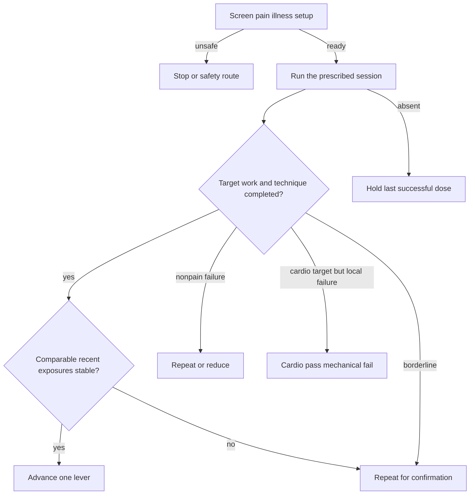
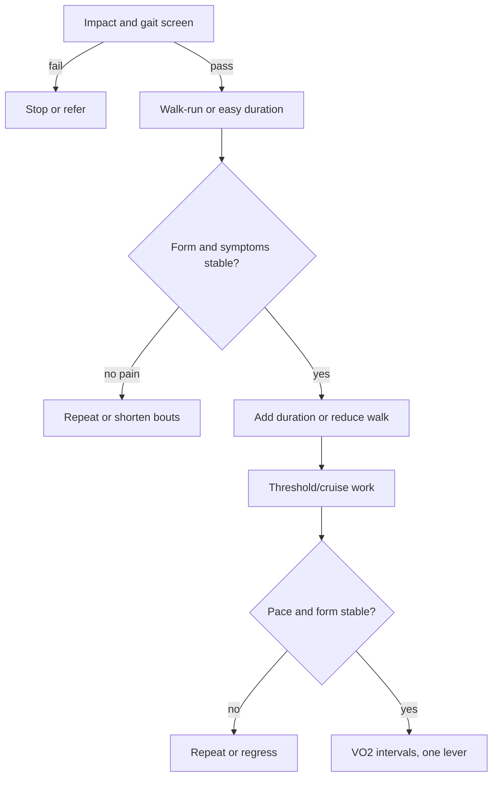
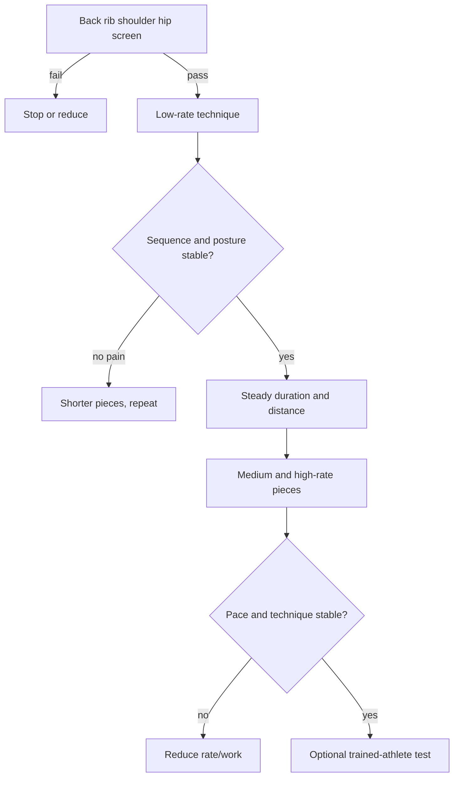
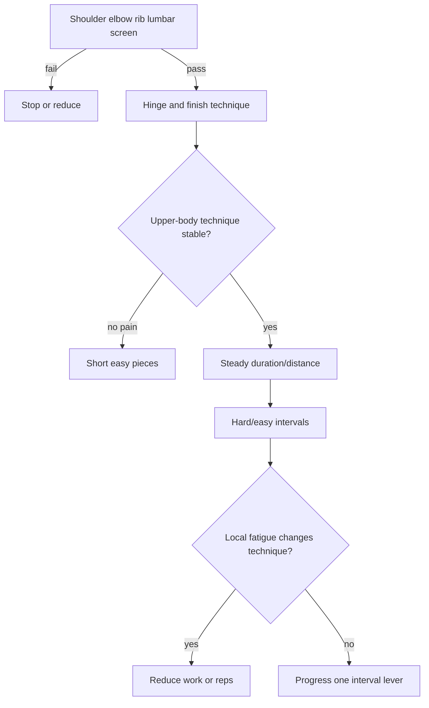
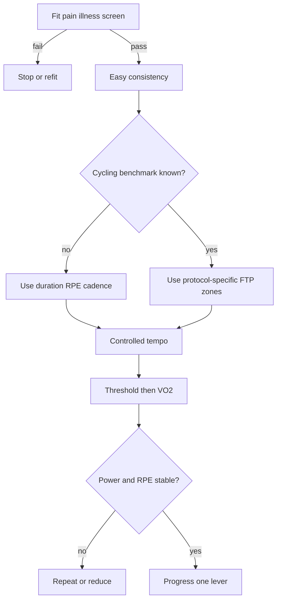
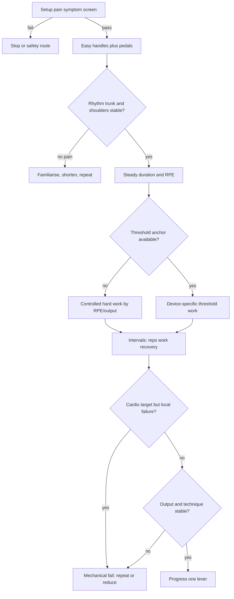
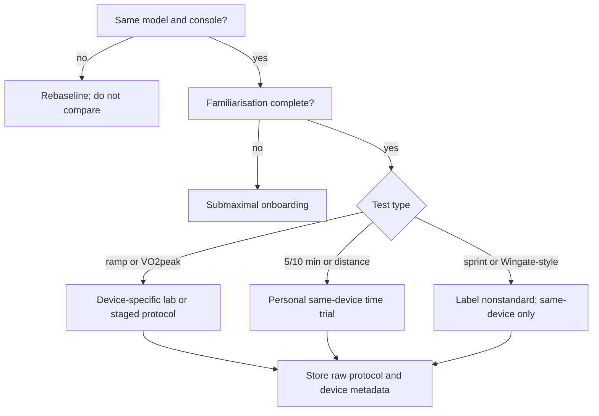

# Five-Modality Progression and Regression Trees

These diagrams are the visual companion to `modality_progression_regression_trees.json`. The exact confirmation count and dose changes are configurable product rules, not universal research thresholds.

## Shared state machine

## Running

## Rowing

## SkiErg / Nordic

## Conventional cycling

## Combined arm-and-leg air bike

## Air-bike benchmark gate

