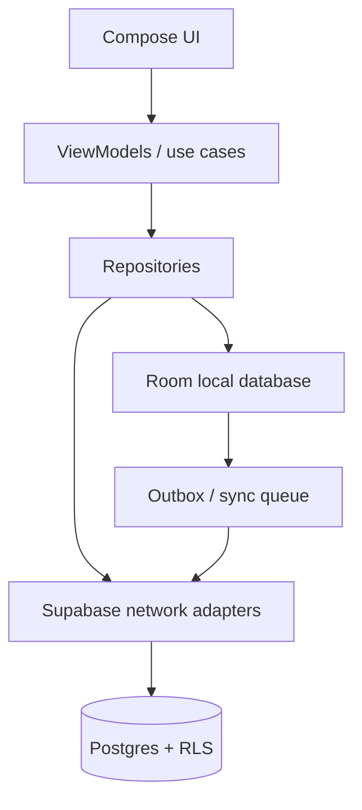

# Architecture, sync, Postgres, and data security

## 1. Target architecture



The UI does not call Supabase directly. Repositories expose local observable
state and coordinate network refresh/sync. The local database is the source of
truth for the UI and the critical logging path. Supabase is the account-level
source of truth after synchronization.

This follows Android’s official offline-first guidance: reads come from a
local source, network results update local state, and queued/lazy writes use a
persistent queue such as WorkManager where appropriate.

## 2. Kotlin module boundaries

Recommended packages/modules as the Android client grows:

```text
app/
  core/model/          shared immutable models and IDs
  core/time/           timezone/day-boundary utilities
  data/local/           Room entities, DAOs, migrations
  data/remote/          Supabase DTOs and API adapters
  data/repository/      source-of-truth and sync orchestration
  domain/food/          search, scaling, provenance, logging use cases
  domain/coach/         Kotlin port of adaptive_engine.py
  domain/recipe/        recipe calculation and snapshot logic
  ui/auth/
  ui/dashboard/
  ui/logger/
  ui/food/
  ui/recipes/
  ui/checkin/
  ui/progress/
  ui/settings/
```

Use Kotlin coroutines and `Flow`/`StateFlow`; collect lifecycle-aware state in
Compose. Use a domain/use-case layer for calculation-heavy or shared rules,
not as a ceremony around every one-line repository call.

## 3. Local-first data design

### Reads

1. UI observes Room.
2. Repository returns cached data immediately.
3. Repository refreshes from Supabase when online and writes the result to
   Room.
4. UI updates because Room changed.

### Writes

For a food log, weight entry, recipe edit, or day-status declaration:

1. validate locally;
2. write to Room in a transaction;
3. create an outbox operation with a stable client operation ID;
4. render success immediately;
5. drain the queue when online with retry/backoff;
6. mark synced or show a recoverable conflict/error.

The logger should not make a user wait for a network round trip. An action that
cannot be safely queued must say so before the user loses their input.

### Conflict policy

* Food database rows are server/source-owned. A source refresh can create a new
  version, but cannot mutate a historical log snapshot.
* User log entries, weights, day-status declarations, favorites, and recipes
  use a stable client ID and last-write metadata. Duplicate retries are
  idempotent.
* A historical edit is a user correction and should win over a stale device
  copy after explicit conflict resolution.
* Concurrent recipe edits should preserve both versions or show a merge screen;
  never silently discard ingredients.
* Deletes are tombstones until all devices acknowledge them.

Add an explicit sync/outbox migration before production. The current
`001_macro_foundation.sql` is the server foundation, not the complete local
sync protocol.

## 4. Historical snapshot rule

`food_log_entries` stores:

* `display_name` at the time of logging;
* calories/macros/nutrients used for that entry;
* the serving quantity/unit used;
* `source_snapshot` containing the source food ID/version and calculation
  inputs.

This prevents a future label correction or source refresh from rewriting the
user’s historical record. If the user chooses to re-log using the corrected
food, create a new entry or explicit edit event.

## 5. Server schema and integrity

The current migration provides these domains:

| Domain | Tables |
| --- | --- |
| Source foods | `foods`, `food_servings` |
| User profile | `nutrition_profiles` |
| User food authoring | `custom_foods`, `recipes`, `recipe_items` |
| Daily logging | `food_log_entries`, `daily_log_status` |
| Body data | `weight_entries`, `weight_trend_points`, `body_measurements`, `progress_photos` |
| Coaching | `macro_programs`, `macro_program_days`, `expenditure_estimates`, `weekly_check_ins`, `user_nutrient_targets` |
| Personal shortcuts | `food_favorites` |

Before production, validate and extend the migration with:

* foreign keys for every ownership relationship;
* `updated_at` triggers or application-side optimistic versioning;
* idempotent source import/upsert strategy;
* server-side aggregate queries for dashboard totals;
* pagination/keyset indexes for long log histories;
* storage policies for progress photos;
* audit/event records for sensitive corrections and account deletion;
* constraints ensuring recipe items refer to exactly one food source;
* tests that reject cross-user references through nested tables.

## 6. RLS and credentials

* Enable RLS on every user-owned table.
* `auth.uid()` must be the ownership predicate; never trust a client-supplied
  user ID.
* Public/authenticated food reads should expose only intended fields.
* Service-role/admin credentials belong only in import jobs or a protected
  server environment.
* Android uses a publishable/anon key and relies on Auth + RLS.
* Test authenticated user A, authenticated user B, anonymous, and service
  role separately.
* Nested ownership must be tested: a user must not insert a `recipe_item`
  referencing another user’s custom food or recipe.

## 7. Privacy and sensitive data

Nutrition logs, weight, measurements, photos, and possible health flags are
personal/sensitive data in practical terms. For an Australian launch, review
the Privacy Act, Australian Privacy Principles, health-privacy guidance, and
cross-border hosting/processor arrangements with qualified counsel.

Engineering defaults:

* collect only fields needed for the feature;
* provide a plain-language privacy policy and retention/deletion controls;
* keep photos on device until the user opts into backup/sync;
* encrypt transport and use platform-secure storage for tokens;
* do not put food logs, weight, or photos into analytics payloads;
* redact health data from crash logs;
* make AI/photo processing opt-in and disclose whether processing is on-device
  or sent to a third party;
* separate product analytics consent from core logging;
* support export and deletion across database and object storage.

## 8. Performance rules

* Never load an entire multi-month log to render today’s dashboard.
* Use server/local aggregate queries for daily and weekly totals.
* Paginate search and history; use exact barcode indexes.
* Keep source nutrient JSON out of list rows unless the detail screen requests
  it.
* Avoid N+1 recipe/food queries; use explicit joins or batch fetches.
* Recompute adaptive results in a bounded window and cache the versioned result.
* Use stable keys in Compose lists and avoid recomputing whole screens on each
  keystroke.
* Measure time-to-first-local-result, barcode-to-result latency, and sync queue
  drain time on low-end devices.

## 9. Android and dependency guidance

The starter currently pins a modern Android toolchain in Gradle files. Claude
Code must verify versions against official Android/Supabase documentation at
implementation time rather than blindly upgrading every dependency.

Recommended platform pieces:

* Jetpack Compose for UI;
* Room for structured local persistence;
* WorkManager for durable background sync;
* CameraX `Preview` + `ImageAnalysis` for camera input;
* on-device ML Kit barcode scanning for EAN/UPC and other supported formats;
* Supabase Kotlin Auth/PostgREST/Realtime as needed, behind repository
  adapters.

## 10. AI and external adapters

Treat these as independent, replaceable adapters:

* `BarcodeScanner` — returns candidate GTINs;
* `FoodLookup` — exact/source lookup;
* `LabelOcr` — returns extracted fields plus confidence and image reference;
* `RecipeUrlExtractor` — returns ingredients/instructions plus source URL;
* `VoiceParser` — returns a proposed search/quick-add intent;
* `PhotoEstimator` — returns a non-verified proposal.

All AI outputs enter a review/confirmation state. They never write directly to
verified `foods` or historical logs without a user action.
