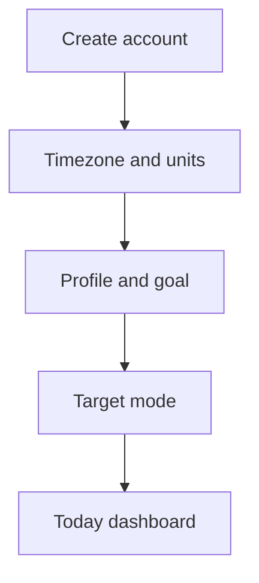
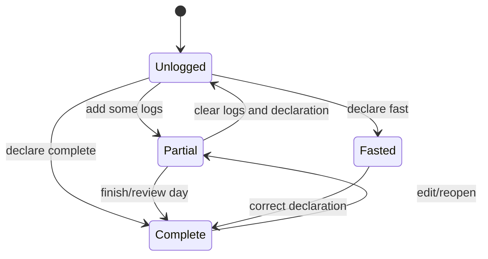

# UX flows and edge cases

## 1. Navigation model

Use five primary destinations with a prominent quick-log action:

1. **Today** — targets, totals, meals, status, and next action.
2. **Log** — search, barcode, recent, favorites, recipes, quick add.
3. **Progress** — weight, trend, expenditure, targets, check-in history.
4. **Foods** — custom foods, recipes, source/provenance, nutrient detail.
5. **Settings** — profile, units, privacy, export/delete, notifications, safety
   mode.

The exact navigation library can change; the state and acceptance behaviour
cannot.

## 2. Onboarding flow

Onboarding should allow “skip for now” for optional inputs. Missing inputs show
what they affect. It must not force a false precision starting target.

## 3. Log-food flow

1. Tap the quick-log action.
2. Choose search, barcode, recent, favorite, recipe, quick add, or custom.
3. Select a candidate and inspect source, serving basis, and data quality.
4. Choose meal, quantity, and unit.
5. Preview scaled calories/macros and available micros.
6. Confirm; write a historical snapshot locally first.
7. Offer “log again”, “copy to another day”, or “edit”.

The main path should not require navigating through a full food-detail page for
a known recent item. The detail page remains available for trust and correction.

## 4. Barcode flow

1. Camera permission is requested in context.
2. Show a stable scan frame and a manual barcode entry option.
3. Restrict scanner formats to expected retail formats when possible.
4. Debounce repeated frames and stop after a candidate is accepted.
5. Normalize the code while preserving leading zeros.
6. Perform exact local lookup first, then server lookup.
7. If found, show product name/brand/source and serving basis.
8. If not found, offer name search, manual label entry, or “report/add food”.
9. Never call a product “verified” merely because a barcode decoded.

## 5. Custom food and label flow

1. User enters name, brand, serving basis, calories, macros, optional micros,
   ingredients, allergens, and optional barcode.
2. Validate non-negative finite values and macro/energy plausibility without
   silently changing them.
3. Show a confirmation preview and label it user-entered.
4. Save as a custom food, distinct from source foods.
5. Allow later edits; historical entries keep their snapshots.

OCR can prefill a draft but must show extracted values and confidence for
review. A failed OCR result should degrade to manual entry, not block logging.

## 6. Recipe flow

* Create recipe name and serving count.
* Add foods/custom foods and quantities.
* Show per-batch and per-serving totals.
* Save as draft until valid.
* Log a selected number of servings as a snapshot.
* Allow duplicate/modify without rewriting historical logs.

When a recipe item has an unknown household-unit mass, ask the user to choose
a compatible unit or keep it as an unscaled note. Do not invent density.

## 7. Day-state flow

The user can change a state. Changes affecting a prior check-in should mark
the affected calculation stale and offer recomputation.

## 8. Check-in flow

1. Open the weekly check-in card.
2. Show coverage first: nutrition days, weigh-ins, missing/partial days, and
   date window.
3. If held, explain why and show actions; do not present a fake update.
4. If updating, show current estimate, raw estimate, damped change, and target
   proposal.
5. User accepts, edits, skips, or declines.
6. Write decision, configuration version, inputs, explanation, and resulting
   macro-program days.
7. Show the next review date and a way to undo/return to manual mode.

## 9. Edge-case matrix

| Case | Required behaviour |
| --- | --- |
| Unknown barcode | Local miss, network miss, then manual/search/report options. No fabricated food. |
| Barcode with leading zero | Preserve and search exact normalized variants; never trim significant zeros. |
| Same barcode, conflicting rows | Show source conflict or documented priority; preserve both source records. |
| Product sold outside Australia but tagged/imported | Keep only when the Australia tag rule accepts it; show countries/provenance. |
| Missing serving mass | Use source basis and quality flag; no cup-to-gram guess. |
| Food uses ml but user enters grams | Reject or ask for a supplied density/measure; do not convert silently. |
| Missing micronutrient | Display unavailable, not zero; exclude from percent target. |
| Source row updated | New source version; old log snapshot unchanged. |
| Unlogged day | Unknown coverage; never zero calories. |
| Declared fast | Explicit fast state; only count in engine under the declared fast contract. |
| Partial day | Visible partial status; excluded from countable intake until user marks complete. |
| Late log edit | Recompute affected window; show that the estimate changed because historical input changed. |
| Duplicate tap/offline retry | Client operation ID makes write idempotent; UI does not duplicate the row. |
| Out-of-order weight entry | Rebuild affected trend window and mark later estimates stale. |
| One anomalous weigh-in | Keep raw value, trend-filter it; do not issue a diagnosis or abrupt target. |
| Timezone/DST boundary | Assign by user-local calendar day and test DST transitions. |
| Recipe ingredient deleted | Preserve historical snapshot; current recipe enters an invalid/draft state. |
| Auth token expired offline | Keep local data/logging; queue sync and request re-auth on reconnect. |
| Network unavailable | Read cache and log locally; show sync status without blocking core flow. |
| RLS denied | Surface a recoverable error; never retry indefinitely or fall back to service role. |
| Photo upload fails | Keep the private local photo and retry/delete explicitly; never lose the measurement record. |
| User selects safety/manual mode | Suppress automatic target changes; still permit neutral tracking and export. |
| AI/OCR uncertainty | Require review; store draft provenance and confidence. |
| User deletes account | Confirm, export option, delete database/storage data, sign out, and verify no retained personal data. |

## 10. Accessibility and interaction quality

* Support large text, screen readers, dynamic contrast, and reduced motion.
* Use touch targets at least the platform-recommended minimum.
* Never encode data quality by colour alone.
* Make scanner/manual fallback equally discoverable.
* Keep the logger usable one-handed and with keyboard-only input.
* Provide undo after destructive-looking actions.
* Avoid streaks and red “failure” states for missed logging.

## 11. Copy principles

Prefer:

* “Not enough data to update yet.”
* “Your last estimate is being carried forward.”
* “Review these incomplete days.”
* “This value came from Open Food Facts / FSANZ / your entry.”
* “You can accept, edit, or skip this proposal.”

Avoid:

* “You failed.”
* “You owe calories.”
* “Your metabolism is broken.”
* “This barcode is accurate” when only the code was recognized.
* “Measured metabolic rate” for a predictive estimate.
