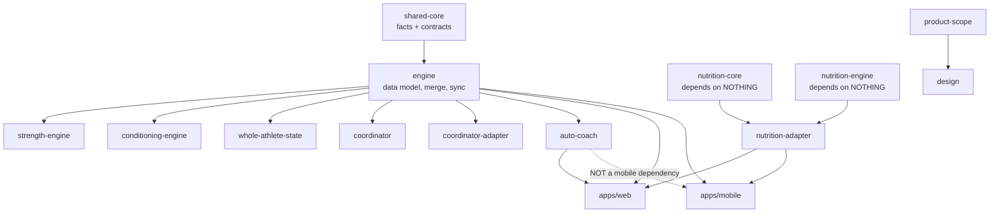
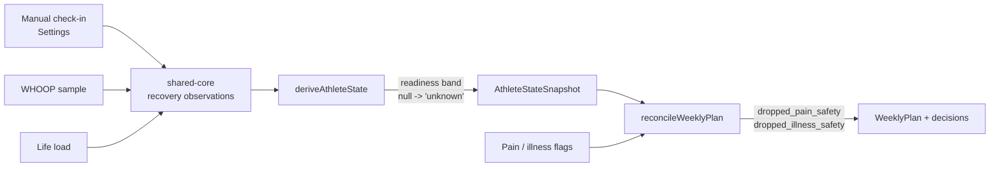
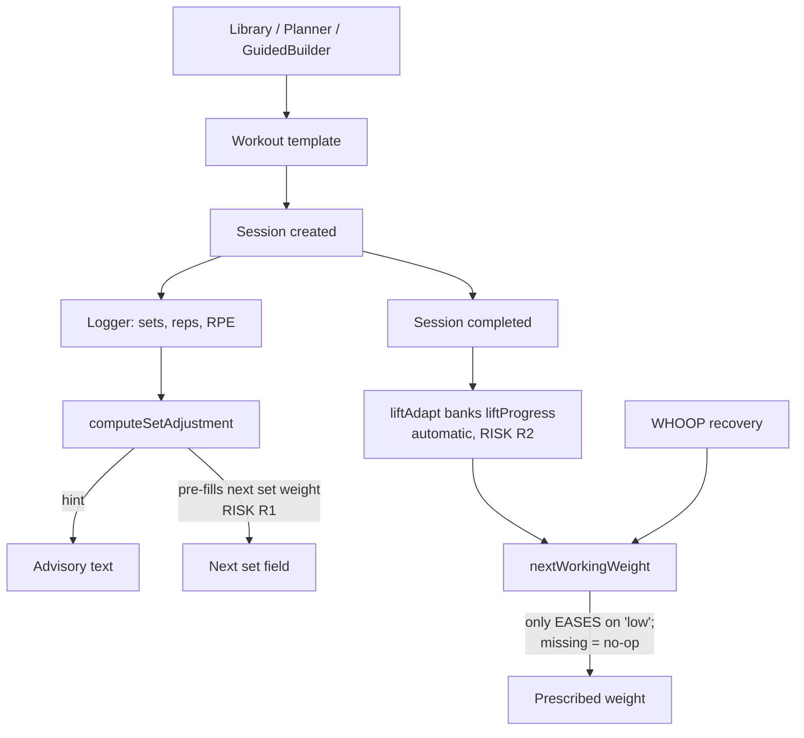
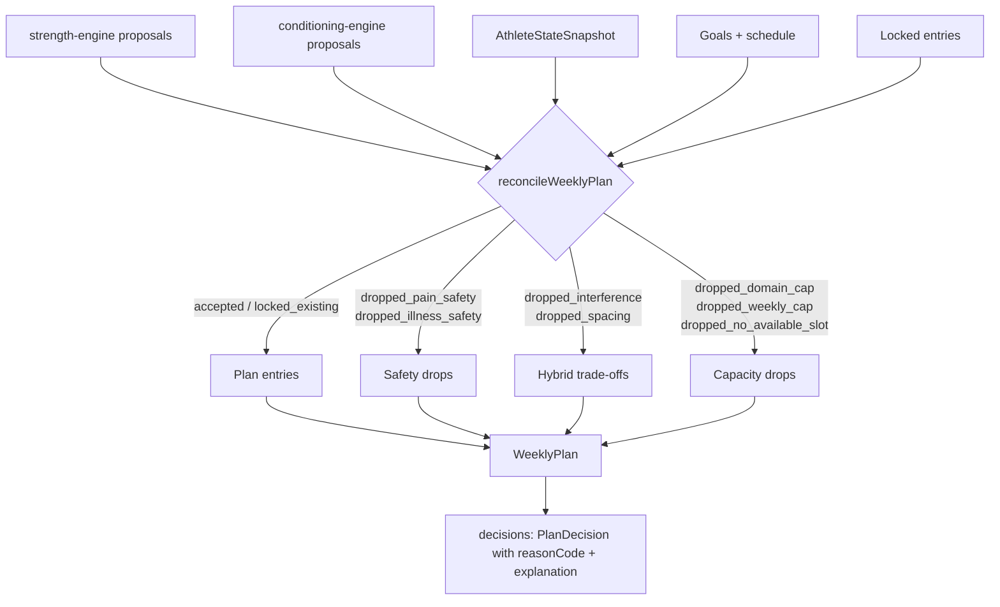
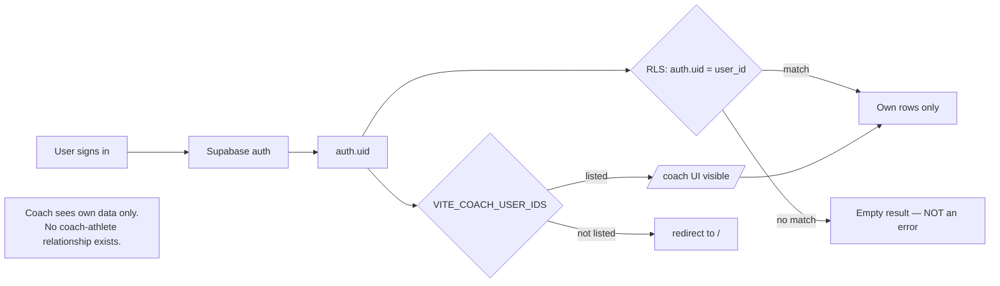

# Actual architecture

Written 8 August 2026 against `main` @ `a8ff104`. Claims cite file and symbol.

## Framework and toolchain

| | |
|---|---|
| Monorepo | pnpm workspaces — `packages/*` and `apps/*` (`pnpm-workspace.yaml`), 17 typechecked projects |
| Web | React 19 + `react-router-dom` 7 + Vite, `apps/web` |
| Mobile | Expo SDK 54 / React Native 0.81 + NativeWind 4, `apps/mobile` |
| Backend | Supabase (Postgres + RLS + RPC), `@supabase/supabase-js` 2 |
| Tests | Vitest (web + packages), **Jest with `jest-expo`** (mobile, `apps/mobile/jest.config.js`) |
| Checks | `checks/*.mjs` — executable invariants, more authoritative than prose |

**Packages are consumed as raw TypeScript source** — every `package.json` has
`main: ./src/index.ts` and a `build` that is only `tsc --noEmit`. There is no
compiled dist. Consequence: the consuming bundler compiles them, and Metro
rejects pnpm symlink shapes that `tsc` resolves happily. `pnpm --filter
@hybrid/mobile bundle` catches what typecheck cannot.

## Dependency direction



Two properties are load-bearing and enforced by boundary tests:

1. **`nutrition-core` and `nutrition-engine` import nothing from `@hybrid/*`.**
   Nutrition cannot reach into training and no training package depends on
   nutrition.
2. **`auto-coach` is web-only.** A known scope gap, not an accident — real
   athletes log on the phone.

## The three worlds

`WorldId = ProductId | 'nutrition'` (`packages/design/src/theme.ts:13`), with
`ProductId = 'strength' | 'conditioning'`
(`packages/product-scope/src/index.ts:3`). One install, a runtime switch, three
themes, three tab bars. **Worlds are a VIEW concept — the database is never
filtered.** Reads may scope; writes never do.

`SessionDomain = 'strength' | 'conditioning'`
(`packages/coordinator/src/types.ts:6`) — nutrition is deliberately outside
what the Coordinator arbitrates.

## Data persistence

| Slice | Key | Syncs |
|---|---|---|
| `EngineDB` (training) | `hybrid-engine-v1` | Yes — legacy `app_state` blob + domain partition |
| `NutritionDB` | `hybrid-nutrition-v1` | Yes — its own partition |
| Scan corpus (OCR diagnostics) | `hybrid-label-scan-corpus-v1` | **Never** |
| Active world | `hybrid-active-discipline-v1` | No — a view preference |
| Auto-coach ledger / policy / consent | `hybrid-auto-coach-*-v1` | **No — see RISK_REGISTER R3** |
| Coach bench state | `hybrid-coach-bench-v1` | No |

Web uses `localStorage`; mobile uses MMKV via a storage port
(`apps/mobile/src/store/storage.ts`), which is also handed to Supabase auth so
sessions survive cold starts.

**Server tables** (22): the RLS-owned core — `athlete_core`,
`athlete_domain_snapshots`, `athlete_events`, `athlete_weekly_plans` — plus 18
MacroTrack catalogue and nutrition tables.

## Authentication, authorization and tenancy

- Supabase email/password. Web persists to `localStorage`; mobile to MMKV with
  `detectSessionInUrl: false` (there is no address bar on native).
- **Tenancy is single-athlete.** Every policy is `auth.uid() = user_id`. The two
  `using (true)` policies are the shared read-only food catalogue.
- `VITE_COACH_USER_IDS` gates **who sees the `/coach` UI**, not whose data they
  see (`apps/web/src/coach/guard.ts`). It is not an authorization boundary.

## Synchronization

Additive merge in both directions; deletes are `deletedAt` tombstones. Writes go
through revision-guarded RPCs (`upsert_athlete_domain_snapshot`,
`record_athlete_event`); the domain allow-list appears in **three** places — the
check constraint and both plpgsql bodies.

`cloudFp(EngineDB)` is the training fingerprint. The nutrition partition is
structurally stripped from `EngineDB.ecosystem`
(`packages/engine/src/ecosystem.ts`) so a meal cannot move it.

```mermaid
sequenceDiagram
  participant UI as Screen
  participant Store as Local store
  participant Sync as SyncProvider
  participant SB as Supabase
  UI->>Store: update(draft) — mutate, persist
  Store-->>Sync: ref updated on render
  Sync->>SB: select app_state
  SB-->>Sync: remote blob
  Sync->>Sync: applyPull -> mergeEngines (additive)
  Sync->>SB: pullEcosystem (RPC)
  Note over Sync: fold merged against CURRENT ref,<br/>so a set logged during the await survives
  Sync->>SB: upsert app_state + domain snapshots
  SB-->>Sync: RPC returns false if revision stale
  Sync->>Sync: stale -> do NOT mark clean; retry next push
```

## Daily check-in data flow



## Session creation and execution



## Coordinator evaluation



## Authentication and ownership



## Offline behaviour

Both clients are offline-first: all reads come from the local slice, writes
persist locally and sync opportunistically. The web app is a PWA
(`vite-plugin-pwa`). **`/coach` is excluded from `navigateFallback`**
(`apps/web/vite.config.ts:79`) so it works online and fails offline — RISK R7.

## Deployment and observability

- Web: Netlify, with `_headers`/`netlify.toml` and a strict CSP (no inline
  `<script>`; `pnpm run check:csp` enforces it).
- Mobile: EAS Android. `runtimeVersion` is a hand-bumped fixed string —
  currently **4**; OTA cannot carry native changes.
- **Observability: none.** No error reporting, metrics or tracing. Failures are
  surfaced to the user in-app (`saveFailed`, `dataRecovered`) and nowhere else.

## Known architectural debt

1. Legacy `app_state` blob remains the live read path alongside domain
   snapshots — a deliberate bridge, removable only after old builds age out.
2. `auto-coach` web-only.
3. Auto-coach ledger/policy/consent are device-local and unsynced.
4. `/coach` offline.
5. No observability.
6. The coach surface has no server-side notion of a coach.
