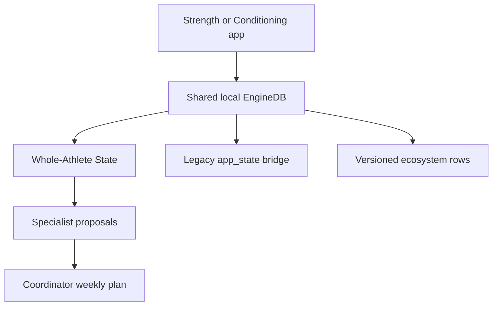

# Fitness Ecosystem rebuild status

Updated 2026-08-04.

## Implemented in this rebuild

| Boundary | Implementation |
|---|---|
| Shared facts | `packages/shared-core` with bounded sanitisation, legacy Settings migration, event vocabulary and per-domain namespace merge rules |
| Recovery/life context | `packages/whole-athlete-state`; sleep, soreness, energy, stress, physical load, illness, pain flags, training density, data quality and advisory HRV |
| Strength | `packages/strength-engine`; Strength proposal adapter plus existing lift/progression functions |
| Conditioning | `packages/conditioning-engine`; Conditioning proposal adapter plus existing cardio/progression functions |
| Coordination | `packages/coordinator`; deterministic placement, spacing, interference, caps, safety decisions and reason codes |
| App projection | `packages/coordinator-adapter`; both apps expose a Coordinated week summary |
| Local persistence | `EngineDB.core` and `EngineDB.ecosystem`, with load-time migration and merge-safe network sanitisation |
| Server boundary | RLS/revision/idempotency migration in `supabase/migrations/20260804_fitness_ecosystem_contracts.sql` |
| Product builds | Web `build:strength` / `build:conditioning`; ONE Android app with a runtime world switch (the Expo per-product profiles are retired) |
| Manual inputs | Settings check-in for sleep, energy, soreness, stress, physical load, time, pain and illness |
| WHOOP | HRV, resting HR and sleep performance are persisted in the new core namespace; HRV remains advisory only |

## Rollout shape



The new ecosystem sync adapter is deliberately feature-gated. This allows a
staging migration and old-client compatibility rehearsal before a public app
starts writing the new tables. The old blob remains dual-written during the
transition; it is not silently removed.

## Product build profiles

Web:

```bash
pnpm --filter @hybrid/web build:strength
pnpm --filter @hybrid/web build:conditioning
```

The web profile changes the PWA name/manifest and output directory. The source
still shares UI while the domain packages and sync boundaries are being
separated; the next release hardening phase can remove non-owned screens from
each profile after canary evidence is collected.

Mobile:

```bash
pnpm --filter @hybrid/mobile build:apk
pnpm --filter @hybrid/mobile build:aab
```

There were two `build:conditioning:*` scripts here, left behind by the Android
merge (7 Aug 2026) and REMOVED in the debug pass that followed. They invoked
EAS profiles `conditioning-preview` and `conditioning-production` that
`apps/mobile/eas.json` never defined — the merged app is one Android app,
`com.hybridengine.app`, with one identity in `app.json`.
`EXPO_PUBLIC_HYBRID_PRODUCT` is retired and setting it fails the build loudly
(`apps/mobile/src/product.ts`). Do not resurrect product flavors on the phone;
the world switch is a runtime preference in its own storage key. Ship a phone
build with `build:apk` / `build:aab`, or the `mobile-eas.yml` workflow.

## Deliberate boundaries and remaining release work

- Nutrition is no longer a separate product. It was rebuilt into this
  repository as a third world (MacroTrack rebuild, Phases 0–4, 7 Aug 2026):
  `@hybrid/nutrition-engine` owns calorie and macro prescription and nothing
  else does, the Coordinator never sees a macro, and whole-athlete-state reads
  nutrition FACTS as context only. See `CLAUDE.md`'s amended nutrition rule and
  the checkpoint at the top of `handoff.md`.
- The Supabase migrations are not applied by local TypeScript tests. Three are
  now staged and unapplied — `20260804_fitness_ecosystem_contracts.sql`,
  `20260807_nutrition_domain.sql` and `20260807_macrotrack_food_catalogue.sql`.
  Apply them in a staging project, run RLS and old-version compatibility tests,
  then set the ecosystem sync feature flag. `node checks/migrations-apply.mjs`
  rehearses all three against a throwaway Postgres first.
- The production store split still needs device testing for BLE, GPS,
  Concept2, permissions, deep links, app deletion/reinstall and rollback.
- A Coordinator service or approved canonical writer must own persisted weekly
  plans before client-side plan publishing is enabled in production.
